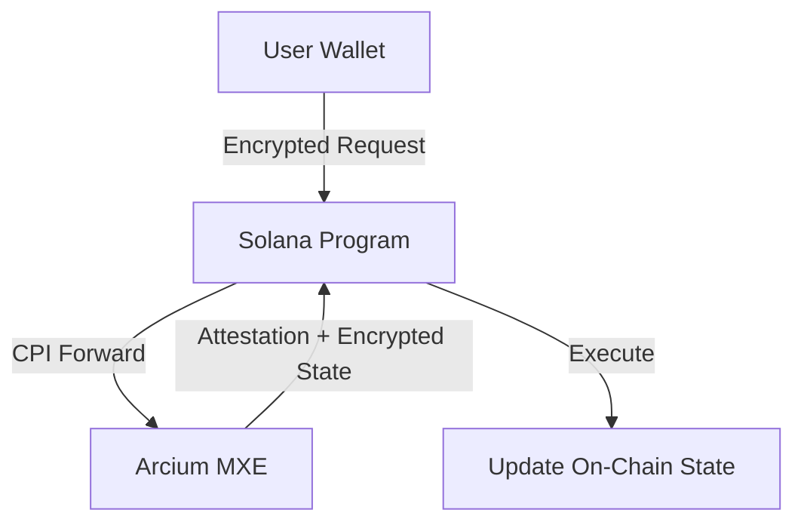
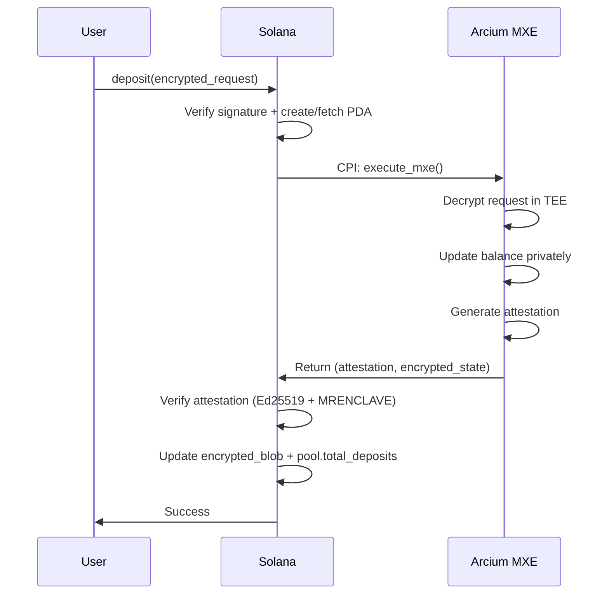
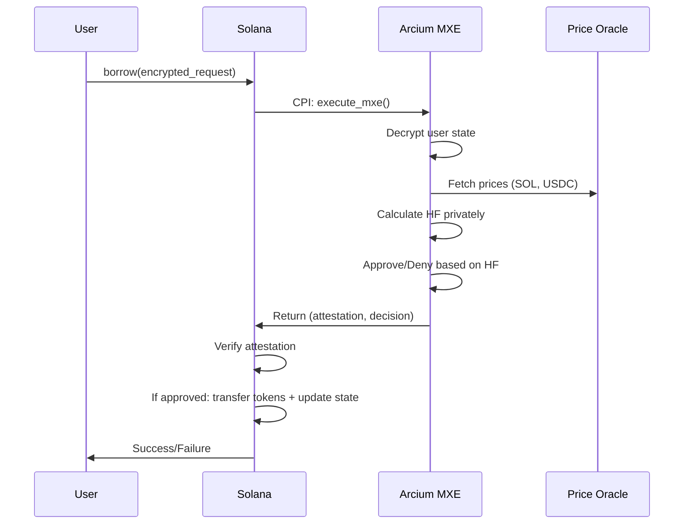
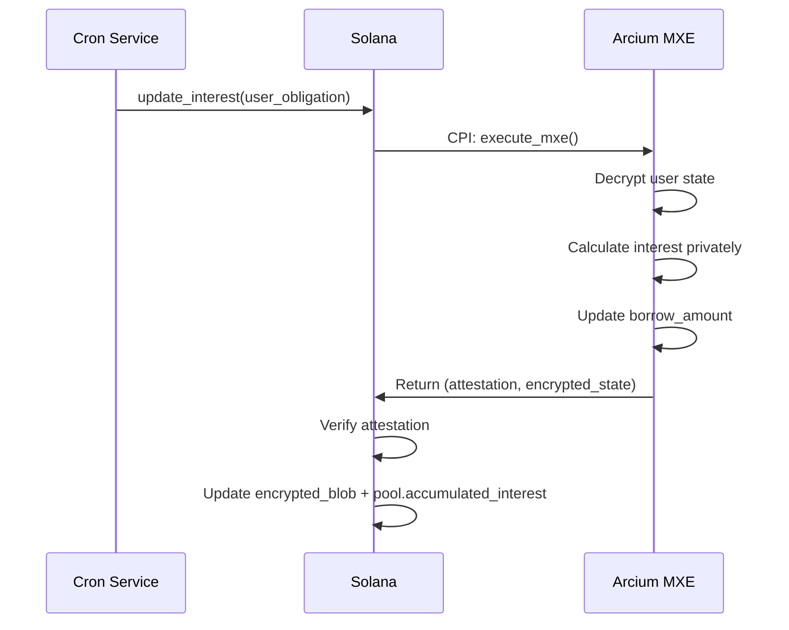
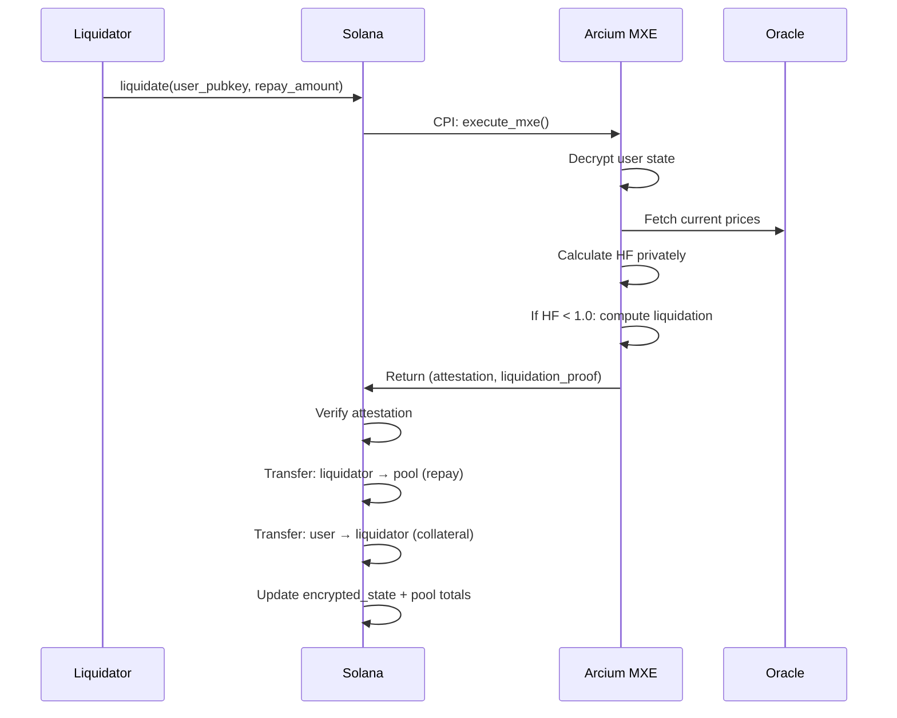
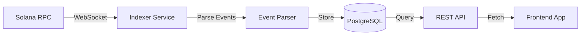

# ShadowLend V1 Architecture (Arcium-Only)

**Private Lending Protocol for Solana Privacy Hackathon 2026**

---

## Executive Summary

ShadowLend V1 is a privacy-preserving lending protocol built on Solana using **Arcium MXE (Multi-party eXecution Environment)** for confidential computation. Users can deposit collateral, borrow assets, and get liquidated—all while keeping their individual balances and health factors **completely private**. Only pool aggregates are public.

**Core Innovation**: Encrypted user states computed inside Arcium's TEE, verified on-chain via Ed25519 attestations.

---

## 1. Tech Stack

| Layer              | Technology                   | Purpose                                      |
| ------------------ | ---------------------------- | -------------------------------------------- |
| **Blockchain**     | Solana (Devnet/Testnet)      | High-throughput L1 for smart contracts       |
| **RPC Provider**   | Helius RPC                   | Reliable RPC + DAS API + Webhooks            |
| **Smart Contracts**| Anchor Framework (Rust)      | Solana program development                   |
| **Privacy Layer**  | Arcium MXE                   | Confidential computation in TEE environment  |
| **Frontend**       | Next.js + React              | Web application UI                           |
| **Styling**        | TailwindCSS                  | Modern responsive design                     |
| **Wallet**         | Solana Wallet Adapter        | Multi-wallet integration                     |
| **Indexer**        | Helius Webhooks              | Transaction history & event tracking         |
| **Oracle**         | Mock Prices (Hackathon)      | Fixed prices for demo; Pyth for production   |
| **State Mgmt**     | Zustand / React Query        | Client-side state management & caching       |

### Helius RPC Endpoints

```bash
# Devnet (for development)
https://devnet.helius-rpc.com/?api-key=YOUR_API_KEY

# Testnet (for testing)
https://testnet.helius-rpc.com/?api-key=YOUR_API_KEY

# Mainnet (production)
https://mainnet.helius-rpc.com/?api-key=YOUR_API_KEY
```

> **ORB Explorer**: Use [orb.helius.dev](https://orb.helius.dev) for visual transaction debugging

### Key Dependencies

```toml
# Anchor Program (Cargo.toml)
anchor-lang = "0.30.x"
anchor-spl = "0.30.x"
solana-program = "2.x"
```

```json
// Frontend (package.json)
"@solana/kit": "^2.0.x",
"@coral-xyz/anchor": "^0.30.x",
"@solana/wallet-adapter-react": "^0.15.x",
"next": "^14.x",
"react": "^18.x"
```

---

## 1.1 Hackathon Simplifications

> **MVP Focus**: Single pool, fixed rates, demo-ready

| Full Version             | Hackathon MVP                          |
| ------------------------ | -------------------------------------- |
| Multi-asset pools        | **Single pool: SOL collateral → USDC** |
| Dynamic interest rates   | **Fixed 5% APY borrow rate**           |
| Pyth oracle integration  | **Mock prices (SOL=$150, USDC=$1)**    |
| Automated interest cron  | **On-demand interest (on borrow/repay)** |
| Multi-cluster support    | **Devnet only**                        |

### Single Pool Design

```
┌─────────────────────────────────────┐
│         SOL/USDC Pool               │
├─────────────────────────────────────┤
│  Collateral: SOL                    │
│  Borrow Asset: USDC                 │
│  LTV: 80%                           │
│  Liquidation Threshold: 85%         │
│  Liquidation Bonus: 5%              │
│  Fixed Borrow Rate: 5% APY          │
└─────────────────────────────────────┘
```

### Mock Oracle Prices

```rust
// For hackathon demo - hardcoded prices
const SOL_PRICE_USD: u64 = 150_00;  // $150.00 (2 decimals)
const USDC_PRICE_USD: u64 = 1_00;   // $1.00 (2 decimals)
```

---

## 2. Core Architecture

### Three-Layer Design



**Layer 1 - User Client**: Encrypts operation requests (deposit/borrow/withdraw) using AES-256-GCM with HKDF-derived keys from transaction signatures.

**Layer 2 - Solana Program**: Verifies user signatures, forwards encrypted requests to Arcium via CPI, validates MXE attestations (Ed25519 + MRENCLAVE), updates encrypted state blobs.

**Layer 3 - Arcium MXE**: Decrypts user requests inside TEE, computes private balances/health factors, generates Ed25519 attestations proving correctness, returns encrypted results.

---

## 3. Account Structures & PDAs

### Pool Account

**PDA Seeds**: `["pool", mint.key()]`  
**Size**: ~320 bytes | **Rent**: 0.00298 SOL (~$0.45)

```rust
pub struct Pool {
    pub authority: Pubkey,           // Protocol admin
    pub mint: Pubkey,                // Lending token (e.g., USDC)

    // Public Aggregates
    pub total_deposits: u128,
    pub total_borrows: u128,
    pub accumulated_interest: u128,

    // Interest Rate Model
    pub utilization_rate: u64,       // 0-100000 (0-100%)
    pub current_borrow_rate: u64,    // APY in basis points
    pub base_rate: u64,              // 2% = 200
    pub optimal_utilization: u64,    // 80% = 80000

    // Risk Parameters
    pub liquidation_threshold: u16,  // 80% = 8000
    pub liquidation_bonus: u16,      // 5% = 500

    // Arcium Integration
    pub arcium_config: Pubkey,
    pub last_update_ts: i64,
}
```

### User Obligation Account

**PDA Seeds**: `["obligation", user.key(), pool.key()]`  
**Size**: ~280 bytes | **Rent**: 0.00284 SOL (~$0.43)

```rust
pub struct UserObligation {
    pub user: Pubkey,
    pub pool: Pubkey,

    // Encrypted State (only MXE can decrypt)
    pub encrypted_state_blob: Vec<u8>,  // Enc<UserState>
    pub state_commitment: [u8; 32],     // SHA-256(encrypted_blob)

    // Attestation Record
    pub last_mxe_attestation: Option<Attestation>,
    pub state_nonce: u64,               // Replay protection
    pub last_update_ts: i64,
}

// Plaintext structure (encrypted in blob)
struct UserState {
    pub deposit_amount: u128,           // Hidden
    pub borrow_amount: u128,            // Hidden
    pub accrued_interest: u128,         // Hidden
    pub last_interest_calc_ts: i64,
}
```

### Arcium Config Account

**PDA Seeds**: `["arcium-config", authority.key()]`  
**Size**: ~200 bytes | **Rent**: 0.00228 SOL (~$0.34)

```rust
pub struct ArciumConfig {
    pub authority: Pubkey,
    pub mxe_registry: Vec<MxeNodeInfo>,  // Trusted MXE nodes
    pub min_attestation_threshold: u8,   // Min valid attestations
    pub max_clock_skew: i64,             // 60 seconds
}

struct MxeNodeInfo {
    pub node_pubkey: Pubkey,
    pub attestation_key: [u8; 32],       // Ed25519 public key
    pub enclave_measurement: [u8; 32],   // MRENCLAVE hash
    pub is_active: bool,
}
```

---

## 4. Core Operations

### A. Deposit

**Theory**: User locks collateral into the protocol. Balance encrypted on-chain; only pool total increases publicly.

**Math**: `new_deposit = old_deposit + amount`

**Flow**:



**Privacy**: Individual deposit amount hidden; only pool aggregate public.

---

### B. Borrow

**Theory**: User borrows against collateral if health factor ≥ 1.0. Health factor computed privately inside MXE.

**Math**:

```
HF = (collateral_value_usd × ltv_weight) / borrow_value_usd
Approve if HF ≥ 1.0
```

**Flow**:



**Privacy**: Health factor never revealed on-chain; only approve/deny decision public.

---

### C. Interest Accrual

**Theory**: Borrowers accrue interest over time based on pool's borrow rate. Computed privately per user.

**Math**:

```
interest = borrow_amount × (rate / 100) × (time_elapsed / YEAR)
new_borrow = old_borrow + interest
```

**Flow**:



**Privacy**: Individual interest hidden; only pool aggregate increases publicly.

---

### D. Liquidation

**Theory**: If user's health factor < 1.0, liquidator can repay debt and seize collateral (+ bonus). HF check done privately.

**Math**:

```
If HF < 1.0:
  collateral_seized = (repay_amount × liquidation_bonus) / collateral_price
  Update: deposit -= collateral_seized, borrow -= repay_amount
```

**Flow**:



**Privacy**: Exact health factor hidden; only liquidation event (amounts) public after execution.

---

## 5. Security Model

### Attestation Verification

Every MXE computation generates an Ed25519 attestation:

```
message = user_pubkey || state_commitment || timestamp
signature = Ed25519_sign(message, mxe_privkey)
```

Solana verifies:

1. **Signature validity**: `Ed25519_verify()` (native, free)
2. **MRENCLAVE match**: Enclave measurement == registered hash
3. **Timestamp freshness**: `now - attestation.timestamp < 60s`
4. **State commitment**: `SHA-256(encrypted_blob) == state_commitment`

### Replay Protection

- `state_nonce` increments on every update
- Old proofs/attestations rejected if nonce already used
- Block height binding (optional): attestations expire after N slots

### No Cheating Possible

- **Cannot borrow without collateral**: MXE computes HF; attestation proves correctness
- **Cannot hide liquidation**: MXE detects HF < 1.0; liquidation forced atomically
- **Cannot forge attestation**: Requires MXE private key (inside TEE)

---

## 6. Indexer (Transaction History Tracking)

The Indexer tracks all protocol events and provides queryable transaction history while preserving privacy.

### Architecture



### Indexed Events

| Event Type       | Data Stored (Public)                         | Privacy                        |
| ---------------- | -------------------------------------------- | ------------------------------ |
| `DepositExecuted`| Pool ID, Timestamp, Public aggregate delta   | Individual amount hidden       |
| `BorrowExecuted` | Pool ID, Timestamp, Public aggregate delta   | Health factor hidden           |
| `InterestAccrued`| Pool ID, Timestamp, Pool interest increment  | Individual interest hidden     |
| `Liquidation`    | Pool ID, Liquidator, Amounts, Timestamp      | HF before liquidation hidden   |

### User Dashboard Queries

```typescript
// Get user's transaction history (returns only public data)
GET /api/v1/user/{wallet}/transactions

// Get pool statistics
GET /api/v1/pool/{poolId}/stats

// Get recent liquidations (public events)
GET /api/v1/liquidations?limit=20
```

### Implementation Options

1. **Helius Webhooks** (Recommended for MVP)
   - Real-time transaction webhooks
   - Pre-built Solana parsing
   - Free tier: 10,000 requests/day

2. **Custom Indexer** (Post-MVP)
   - Self-hosted Geyser plugin
   - Full control over data
   - Better for high-volume

---

## 7. Cost Analysis

### One-Time Costs (per user)

| Account         | Rent        | USD   |
| --------------- | ----------- | ----- |
| User Obligation | 0.00284 SOL | $0.43 |

### Per-Transaction Costs

| Operation       | Compute Units | Base Fee     | Priority Fee (avg) | Total        |
| --------------- | ------------- | ------------ | ------------------ | ------------ |
| Deposit         | ~51,600 CU    | 0.000005 SOL | ~0.00005 SOL       | ~0.000055 SOL|
| Borrow          | ~51,600 CU    | 0.000005 SOL | ~0.00005 SOL       | ~0.000055 SOL|
| Interest Update | ~500 CU       | 0.000005 SOL | ~0.00001 SOL       | ~0.000015 SOL|
| Liquidation     | ~110,000 CU   | 0.000005 SOL | ~0.0001 SOL        | ~0.000105 SOL|

> **Note**: Solana base fee is 5,000 lamports (0.000005 SOL). Priority fees vary by network congestion.

### Scaling (1,000 users)

- **Setup (rent)**: 2.84 SOL (~$426 one-time)
- **Monthly ops** (100 tx/user avg): ~5.5 SOL (~$825)

---

## 8. Interest Rate Model

**Linear Utilization Model** (Aave-inspired):

```
Utilization = Total_Borrows / Total_Deposits

If U < Optimal (80%):
  Borrow_APY = Base_Rate + (U × Slope1)

If U ≥ Optimal:
  Borrow_APY = Base_Rate + (Optimal × Slope1) + ((U - Optimal) × Slope2)

Deposit_APY = Borrow_APY × U × (1 - Reserve_Factor)
```

**Parameters**:

- Base Rate: 2%
- Optimal Utilization: 80%
- Slope1: 4%
- Slope2: 100%
- Reserve Factor: 10%

**Example** (50% utilization):

- Borrow APY: 2% + (50% × 4%) = 4%
- Deposit APY: 4% × 50% × 90% = 1.8%

---

## 9. Development Timeline (3 Weeks)

### Week 1: Foundation

- Days 1-2: Solana program scaffold (Pool, UserObligation PDAs)
- Days 3-4: Arcium integration (CPI, attestation verification)
- Days 5-7: Deposit flow working end-to-end

### Week 2: Core Features

- Days 1-3: Borrow flow (private HF check)
- Days 4-5: Interest accrual (automated updates)
- Days 6-7: Liquidation flow + testing

### Week 3: Demo & Polish

- Days 1-2: Bug fixes + performance optimization
- Days 3-4: Simple React UI (deposit/borrow/liquidate)
- Days 5-6: Documentation + end-to-end testing
- Day 7: Submission prep

---

## 10. Privacy Guarantees

| Data                | Visibility | Mechanism           |
| ------------------- | ---------- | ------------------- |
| Individual deposits | **HIDDEN** | Encrypted blob      |
| Individual borrows  | **HIDDEN** | Encrypted blob      |
| Health factors      | **HIDDEN** | Computed in TEE     |
| Accrued interest    | **HIDDEN** | Encrypted blob      |
| Pool totals         | **PUBLIC** | Required for rates  |
| Liquidation events  | **PUBLIC** | Transparency needed |

**Result**: Users can lend/borrow privately while protocol remains transparent and trustless.

---

## Summary

ShadowLend V1 achieves **production-ready private lending** in 3 weeks using:

- ✅ Arcium MXE for confidential computation (~500ms)
- ✅ Ed25519 attestations for trustless verification
- ✅ Encrypted on-chain state ($0.43/user)
- ✅ Standard DeFi features (deposit, borrow, liquidate, interest)
- ✅ Zero knowledge of individual positions while maintaining protocol security

**Next Steps**: Build the Solana program → Integrate Arcium SDK → Ship demo 🚀
