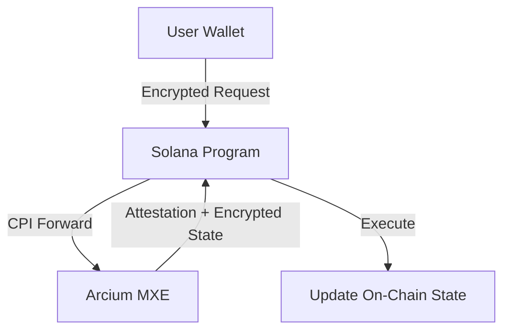
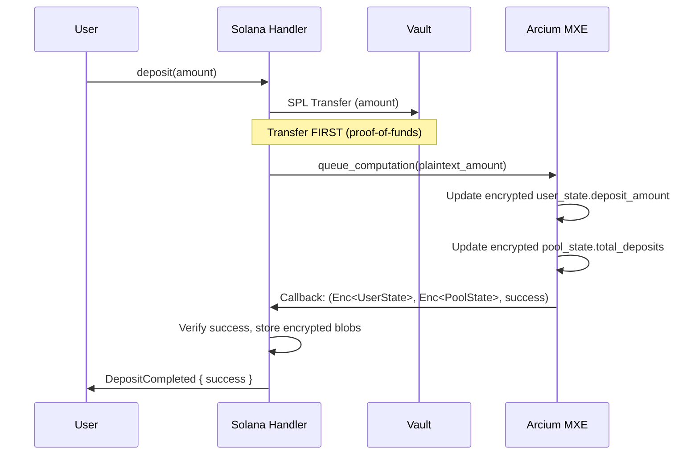
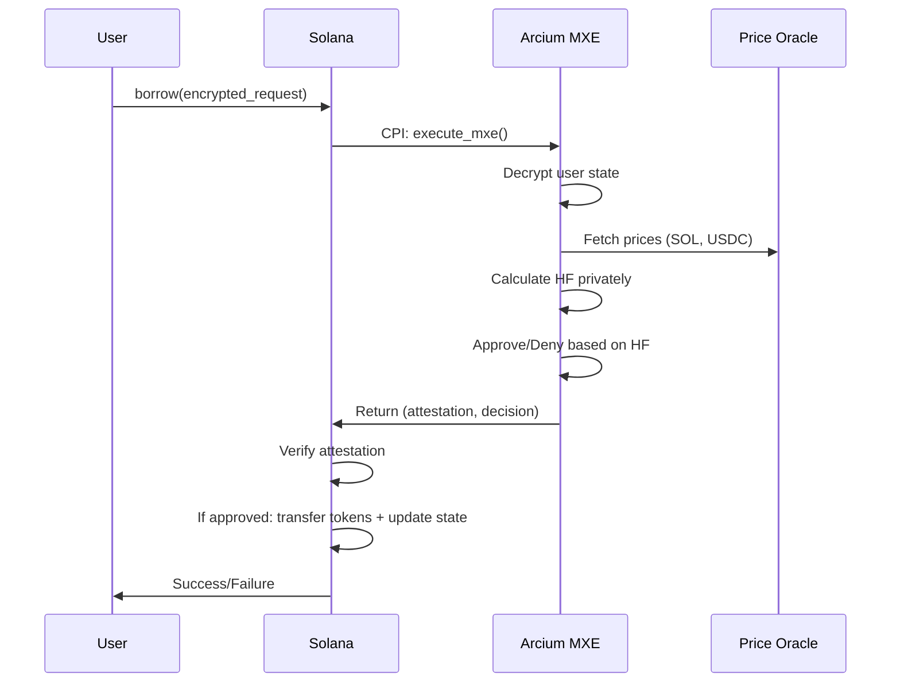
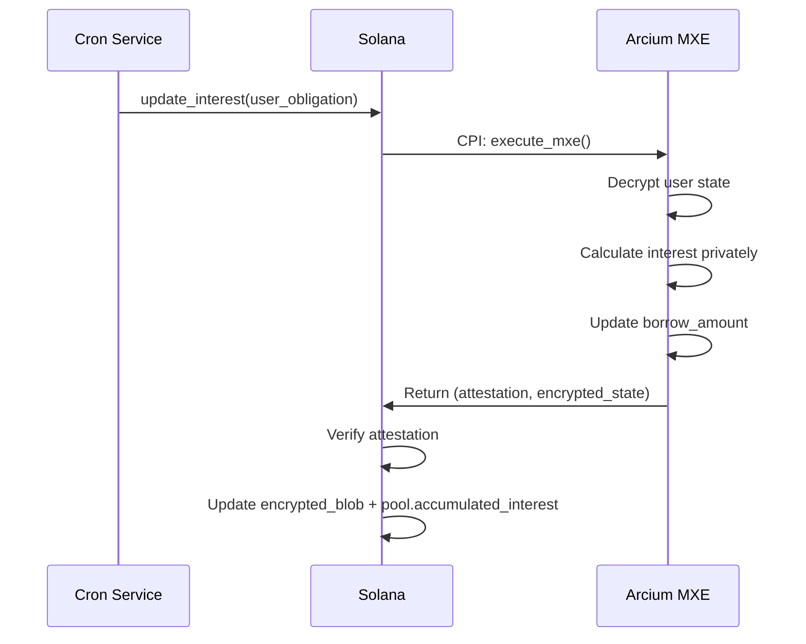
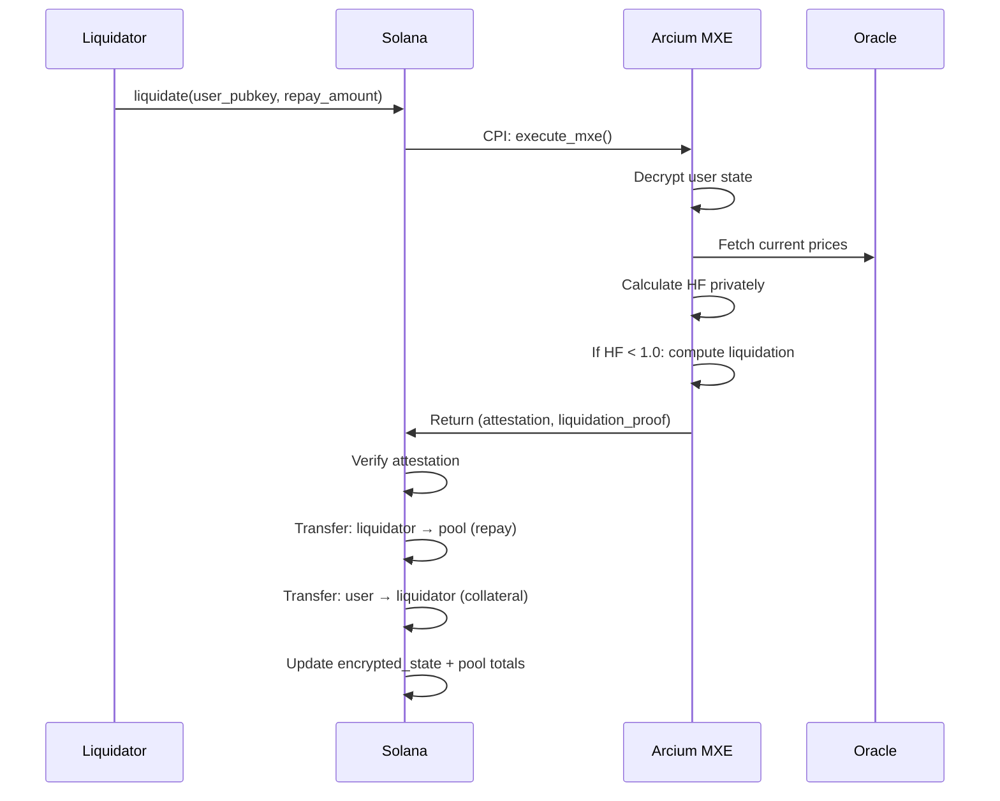
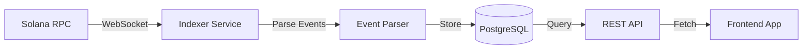

# ShadowLend V1 Architecture (Arcium Hybrid Privacy)

**Private Lending Protocol for Solana Privacy Hackathon 2026**

---

## Executive Summary

ShadowLend V1 is a **privacy-preserving** lending protocol built on Solana using **Arcium MXE (Multi-party eXecution Environment)**. Users can deposit collateral, borrow assets, and manage positions while keeping **balances and health factors completely private**.

**Core Innovation - Hybrid Privacy Model**: 
- **Encrypted User State**: User balances hidden using `Enc<Shared, UserState>` - user can decrypt with private key
- **Encrypted Pool State**: Pool TVL hidden using `Enc<Mxe, PoolState>` - only MXE can decrypt
- **Atomic Deposits**: Single-transaction deposit with public transfer + private state update
- **Revealed Transfers**: Borrow/Withdraw amounts revealed in callbacks for SPL compatibility
- **Private Health Factors**: HF calculations happen entirely within Arcium MXE

---

## 1. Tech Stack

| Layer              | Technology                   | Purpose                                      |
| ------------------ | ---------------------------- | -------------------------------------------- |
| **Blockchain**     | Solana (Devnet/Testnet)      | High-throughput L1 for smart contracts       |
| **RPC Provider**   | Helius RPC                   | Reliable RPC + DAS API + Webhooks            |
| **Smart Contracts**| Anchor Framework (Rust)      | Solana program development                   |
| **Privacy Layer**  | Arcium MXE                   | Confidential computation in TEE environment  |
| **Frontend**       | Next.js + React              | Web application UI                           |
| **Styling**        | TailwindCSS                  | Modern responsive design                     |
| **Wallet**         | Solana Wallet Adapter        | Multi-wallet integration                     |
| **Indexer**        | Helius Webhooks              | Transaction history & event tracking         |
| **Oracle**         | Pyth Network                 | Real-time price feeds (SOL/USD, USDC/USD)    |
| **State Mgmt**     | Zustand / React Query        | Client-side state management & caching       |

### Helius RPC Endpoints

```bash
# Devnet (for development)
https://devnet.helius-rpc.com/?api-key=YOUR_API_KEY

# Testnet (for testing)
https://testnet.helius-rpc.com/?api-key=YOUR_API_KEY

# Mainnet (production)
https://mainnet.helius-rpc.com/?api-key=YOUR_API_KEY
```

> **ORB Explorer**: Use [orb.helius.dev](https://orb.helius.dev) for visual transaction debugging

### Key Dependencies

```toml
# Anchor Program (Cargo.toml)
anchor-lang = "0.30.x"
anchor-spl = "0.30.x"
solana-program = "2.x"
```

```json
// Frontend (package.json)
"@solana/kit": "^2.0.x",
"@coral-xyz/anchor": "^0.30.x",
"@solana/wallet-adapter-react": "^0.15.x",
"next": "^14.x",
"react": "^18.x"
```

---

## 1.1 Hackathon Simplifications

> **MVP Focus**: Single pool, fixed rates, demo-ready

| Full Version             | Hackathon MVP                          |
| ------------------------ | -------------------------------------- |
| Multi-asset pools        | **Single pool: SOL collateral → USDC** |
| Dynamic interest rates   | **Fixed 5% APY borrow rate**           |
| Multiple oracles         | **Pyth Network (SOL/USD, USDC/USD)**   |
| Automated interest cron  | **On-demand interest (on borrow/repay)** |
| Multi-cluster support    | **Devnet only**                        |

### Single Pool Design

```
┌─────────────────────────────────────┐
│         SOL/USDC Pool               │
├─────────────────────────────────────┤
│  Collateral: SOL                    │
│  Borrow Asset: USDC                 │
│  LTV: 80%                           │
│  Liquidation Threshold: 85%         │
│  Liquidation Bonus: 5%              │
│  Fixed Borrow Rate: 5% APY          │
└─────────────────────────────────────┘
```

### Pyth Oracle Integration

```rust
// Real-time prices from Pyth Network
// Feed IDs (mainnet & devnet):
const SOL_USD_FEED_ID: [u8; 32] = hex!("ef0d8b6fda2ceba41da15d4095d1da392a0d2f8ed0c6c7bc0f4cfac8c280b56d");
const USDC_USD_FEED_ID: [u8; 32] = hex!("eaa020c61cc479712813461ce153894a96a6c00b21ed0cfc2798d1f9a9e9c94a");

// Prices read via manual account parsing (30s staleness check)
let sol_price_cents = get_price_from_pyth_account(&sol_price_update, &SOL_USD_FEED_ID, &clock)?;
let usdc_price_cents = get_price_from_pyth_account(&usdc_price_update, &USDC_USD_FEED_ID, &clock)?;
```

> [!NOTE]
> Manual Pyth account parsing is used instead of `pyth-solana-receiver-sdk` due to version conflict with Arcium's `solana-program 2.3.0`.

---

## 2. Core Architecture

### Three-Layer Design



**Layer 1 - User Client**: Encrypts operation requests (deposit/borrow/withdraw) using AES-256-GCM with HKDF-derived keys from transaction signatures.

**Layer 2 - Solana Program**: Verifies user signatures, forwards encrypted requests to Arcium via CPI, validates MXE attestations (Ed25519 + MRENCLAVE), updates encrypted state blobs.

**Layer 3 - Arcium MXE**: Decrypts user requests inside TEE, computes private balances/health factors, generates Ed25519 attestations proving correctness, returns encrypted results.

---

## 3. Account Structures & PDAs

### Pool Account (Confidential)

**PDA Seeds**: `["pool", collateral_mint.key()]`  
**Size**: ~400 bytes | **Rent**: 0.00350 SOL (~$0.53)

```rust
pub struct Pool {
    pub authority: Pubkey,
    pub collateral_mint: Pubkey,     // e.g., SOL
    pub borrow_mint: Pubkey,         // e.g., USDC

    // === ENCRYPTED Pool Aggregates (Enc<Mxe, PoolState>) ===
    // Pool TVL is now HIDDEN - prevents tracking attacks
    pub encrypted_pool_state: Vec<u8>,
    pub pool_state_commitment: [u8; 32],  // SHA-256 verification hash

    // === Risk Parameters (Public for transparency) ===
    pub ltv: u16,                    // 80% = 8000
    pub liquidation_threshold: u16,  // 85% = 8500
    pub liquidation_bonus: u16,      // 5% = 500
    pub fixed_borrow_rate: u64,      // 5% APY = 500 bps

    // === Vault Tracking ===
    pub vault_nonce: u128,           // Deposit tracking (u128 for future protection)
    pub last_update_ts: i64,
    pub bump: u8,
}

// Plaintext structure encrypted in encrypted_pool_state
pub struct PoolState {
    pub total_deposits: u128,
    pub total_borrows: u128,
    pub accumulated_interest: u128,
    pub available_borrow_liquidity: u128,
}
```

### User Obligation Account (Confidential)

**PDA Seeds**: `["obligation", user.key(), pool.key()]`  
**Size**: ~320 bytes | **Rent**: 0.00310 SOL (~$0.47)

```rust
pub struct UserObligation {
    pub user: Pubkey,
    pub pool: Pubkey,

    // === Encrypted State (Enc<Shared, UserState>) ===
    // User can decrypt with their private key
    pub encrypted_state_blob: Vec<u8>,
    pub state_commitment: [u8; 32],     // SHA-256 verification hash

    // === Two-Phase Deposit Tracking ===
    pub total_funded: u64,              // Cumulative tokens funded (visible)
    pub total_claimed: u64,             // Cumulative tokens claimed (visible)

    // === Withdrawal State ===
    pub has_pending_withdrawal: bool,
    pub withdrawal_request_ts: i64,

    // === Replay Protection ===
    pub state_nonce: u128,              // u128 for future protection
    pub last_update_ts: i64,
    pub bump: u8,
}

// Plaintext structure (encrypted in blob, user can decrypt)
pub struct UserState {
    pub deposit_amount: u128,           // Hidden from observers
    pub borrow_amount: u128,            // Hidden from observers
    pub accrued_interest: u128,         // Hidden from observers
    pub last_interest_calc_ts: i64,
}
```

### Arcium Config Account

**PDA Seeds**: `["arcium-config", authority.key()]`  
**Size**: ~200 bytes | **Rent**: 0.00228 SOL (~$0.34)

```rust
pub struct ArciumConfig {
    pub authority: Pubkey,
    pub mxe_registry: Vec<MxeNodeInfo>,  // Trusted MXE nodes
    pub min_attestation_threshold: u8,   // Min valid attestations
    pub max_clock_skew: i64,             // 60 seconds
}

struct MxeNodeInfo {
    pub node_pubkey: Pubkey,
    pub attestation_key: [u8; 32],       // Ed25519 public key
    pub enclave_measurement: [u8; 32],   // MRENCLAVE hash
    pub is_active: bool,
}
```

---

## 4. Core Operations

### A. Deposit (Atomic Model)

**Theory**: Deposit uses a single atomic transaction where the SPL transfer serves as proof-of-funds for the Arcium computation.

> [!IMPORTANT]
> The original "Two-Phase Deposit" design was replaced with this Atomic model to prevent double-spending vulnerabilities.

**Flow**:



**Privacy Trade-off**: 
- ✅ Deposit amounts ARE visible (SPL transfer is public)
- ✅ Encrypted balances remain private
- ✅ No stuck funds vulnerability


---

### B. Borrow

**Theory**: User borrows against collateral if health factor ≥ 1.0. Health factor computed privately inside MXE.

**Math**:

```
HF = (collateral_value_usd × ltv_weight) / borrow_value_usd
Approve if HF ≥ 1.0
```

**Flow**:



**Privacy**: Health factor never revealed on-chain; only approve/deny decision public.

---

### C. Interest Accrual

**Theory**: Borrowers accrue interest over time based on pool's borrow rate. Computed privately per user.

**Math**:

```
interest = borrow_amount × (rate / 100) × (time_elapsed / YEAR)
new_borrow = old_borrow + interest
```

**Flow**:



**Privacy**: Individual interest hidden; only pool aggregate increases publicly.

---

### D. Liquidation

**Theory**: If user's health factor < 1.0, liquidator can repay debt and seize collateral (+ bonus). HF check done privately.

**Math**:

```
If HF < 1.0:
  collateral_seized = (repay_amount × liquidation_bonus) / collateral_price
  Update: deposit -= collateral_seized, borrow -= repay_amount
```

**Flow**:



**Privacy**: Exact health factor hidden; only liquidation event (amounts) public after execution.

---

## 5. Security Model

### Attestation Verification

Every MXE computation generates an Ed25519 attestation:

```
message = user_pubkey || state_commitment || timestamp
signature = Ed25519_sign(message, mxe_privkey)
```

Solana verifies:

1. **Signature validity**: `Ed25519_verify()` (native, free)
2. **MRENCLAVE match**: Enclave measurement == registered hash
3. **Timestamp freshness**: `now - attestation.timestamp < 60s`
4. **State commitment**: `SHA-256(encrypted_blob) == state_commitment`

### Replay Protection

- `state_nonce` increments on every update
- Old proofs/attestations rejected if nonce already used
- Block height binding (optional): attestations expire after N slots

### No Cheating Possible

- **Cannot borrow without collateral**: MXE computes HF; attestation proves correctness
- **Cannot hide liquidation**: MXE detects HF < 1.0; liquidation forced atomically
- **Cannot forge attestation**: Requires MXE private key (inside TEE)

---

## 6. Indexer (Transaction History Tracking)

The Indexer tracks all protocol events and provides queryable transaction history while preserving privacy.

### Architecture



## What indexer should track
For each operation:
├── Queued event → Mark as "PENDING"
├── Completed event → Mark as "CONFIRMED", link to Queued
└── Timeout (no Completed after X blocks) → Mark as "FAILED"

Transaction History:
├── User: pubkey
├── Pool: pubkey
├── Type: deposit/borrow/withdraw/etc
├── Status: pending/confirmed/failed
├── Queued TX: signature
├── Completed TX: signature (nullable)
└── state_nonce: for ordering

### Indexed Events

| Event Type       | Data Stored (Public)                         | Privacy                        |
| ---------------- | -------------------------------------------- | ------------------------------ |
| `DepositExecuted`| Pool ID, Timestamp, Public aggregate delta   | Individual amount hidden       |
| `BorrowExecuted` | Pool ID, Timestamp, Public aggregate delta   | Health factor hidden           |
| `InterestAccrued`| Pool ID, Timestamp, Pool interest increment  | Individual interest hidden     |
| `Liquidation`    | Pool ID, Liquidator, Amounts, Timestamp      | HF before liquidation hidden   |

### User Dashboard Queries

```typescript
// Get user's transaction history (returns only public data)
GET /api/v1/user/{wallet}/transactions

// Get pool statistics
GET /api/v1/pool/{poolId}/stats

// Get recent liquidations (public events)
GET /api/v1/liquidations?limit=20
```

### Implementation Options

1. **Helius Webhooks** (Recommended for MVP)
   - Real-time transaction webhooks
   - Pre-built Solana parsing
   - Free tier: 10,000 requests/day

2. **Custom Indexer** (Post-MVP)
   - Self-hosted Geyser plugin
   - Full control over data
   - Better for high-volume

---

## 7. Cost Analysis

### One-Time Costs (per user)

| Account         | Rent        | USD   |
| --------------- | ----------- | ----- |
| User Obligation | 0.00284 SOL | $0.43 |

### Per-Transaction Costs

| Operation       | Compute Units | Base Fee     | Priority Fee (avg) | Total        |
| --------------- | ------------- | ------------ | ------------------ | ------------ |
| Deposit         | ~51,600 CU    | 0.000005 SOL | ~0.00005 SOL       | ~0.000055 SOL|
| Borrow          | ~51,600 CU    | 0.000005 SOL | ~0.00005 SOL       | ~0.000055 SOL|
| Interest Update | ~500 CU       | 0.000005 SOL | ~0.00001 SOL       | ~0.000015 SOL|
| Liquidation     | ~110,000 CU   | 0.000005 SOL | ~0.0001 SOL        | ~0.000105 SOL|

> **Note**: Solana base fee is 5,000 lamports (0.000005 SOL). Priority fees vary by network congestion.

### Scaling (1,000 users)

- **Setup (rent)**: 2.84 SOL (~$426 one-time)
- **Monthly ops** (100 tx/user avg): ~5.5 SOL (~$825)

---

## 8. Interest Rate Model

**Linear Utilization Model** (Aave-inspired):

```
Utilization = Total_Borrows / Total_Deposits

If U < Optimal (80%):
  Borrow_APY = Base_Rate + (U × Slope1)

If U ≥ Optimal:
  Borrow_APY = Base_Rate + (Optimal × Slope1) + ((U - Optimal) × Slope2)

Deposit_APY = Borrow_APY × U × (1 - Reserve_Factor)
```

**Parameters**:

- Base Rate: 2%
- Optimal Utilization: 80%
- Slope1: 4%
- Slope2: 100%
- Reserve Factor: 10%

**Example** (50% utilization):

- Borrow APY: 2% + (50% × 4%) = 4%
- Deposit APY: 4% × 50% × 90% = 1.8%

---

## 9. Development Timeline (3 Weeks)

### Week 1: Foundation

- Days 1-2: Solana program scaffold (Pool, UserObligation PDAs)
- Days 3-4: Arcium integration (CPI, attestation verification)
- Days 5-7: Deposit flow working end-to-end

### Week 2: Core Features

- Days 1-3: Borrow flow (private HF check)
- Days 4-5: Interest accrual (automated updates)
- Days 6-7: Liquidation flow + testing

### Week 3: Demo & Polish

- Days 1-2: Bug fixes + performance optimization
- Days 3-4: Simple React UI (deposit/borrow/liquidate)
- Days 5-6: Documentation + end-to-end testing
- Day 7: Submission prep

---

## 10. Privacy Guarantees (Hybrid Model)

| Data                | Visibility | Mechanism           |
| ------------------- | ---------- | ------------------- |
| User balances       | **HIDDEN** | `Enc<Shared, UserState>` - user decrypts |
| Health factors      | **HIDDEN** | Computed in Arcium MXE only |
| Pool totals         | **HIDDEN** | `Enc<Mxe, PoolState>` |
| Deposit amounts     | **PUBLIC** | SPL Transfer (atomic) |
| Borrow amounts      | **PUBLIC** | Revealed in callback |
| Repay amounts       | **PUBLIC** | SPL Transfer (atomic) |
| Withdraw amounts    | **PUBLIC** | Revealed in callback |
| Liquidation events  | **PUBLIC** | Revealed amounts |

**Trade-off**: Transfer amounts are public for SPL compatibility, but **user positions remain private**.

---

## 11. Assumptions & Constants (MVP)

> **CRITICAL**: These values are hardcoded for the hackathon MVP and must be updated for production.

### Hardcoded Constants

| Constant                 | Value                       | Location                          | Notes                                |
| ------------------------ | --------------------------- | --------------------------------- | ------------------------------------ |
| **SOL Price**            | Pyth Oracle (real-time)     | `constants.rs`                    | Feed: `0xef0d...b56d`                |
| **USDC Price**           | Pyth Oracle (real-time)     | `constants.rs`                    | Feed: `0xeaa0...c94a`                |
| **Price Staleness**      | 30 seconds max              | `constants.rs`                    | Transactions fail if stale           |
| **LTV (Loan-to-Value)**  | 80% (8000 bps)              | Pool initialization               | Maximum borrowing power              |
| **Liquidation Threshold**| 85% (8500 bps)              | Pool initialization               | HF < 1.0 triggers liquidation        |
| **Liquidation Bonus**    | 5% (500 bps)                | Pool initialization               | Liquidator profit incentive          |
| **Fixed Borrow Rate**    | 5% APY (500 bps)            | Pool initialization               | No dynamic rate model                |
| **Seconds Per Year**     | 31,536,000                  | Interest circuit                  | Used for APY calculations            |

### Encryption & Privacy Model

| Component                  | Algorithm/Method             | Purpose                            |
| -------------------------- | ---------------------------- | ---------------------------------- |
| **User State Encryption**  | `Enc<Shared, UserState>`     | User can decrypt with private key  |
| **Pool State Encryption**  | `Enc<Mxe, PoolState>`        | Only MXE can decrypt pool TVL      |
| **Shared Key Derivation**  | x25519 (Arcium SDK)          | User-MXE shared secret             |
| **Ciphertext Format**      | Arcium ciphertext arrays     | 32-byte encrypted fields           |
| **State Commitment**       | XOR-based folding hash       | See note below                     |

> [!WARNING]  
> **State Commitment Issue**: The current implementation uses XOR-based folding (`commitment[i % 32] ^= byte`) instead of SHA-256 as documented in the architecture diagrams. This is weaker than cryptographic hashing. See TODO for upgrade path.

### Attestation & Verification

| Component                  | Method                       | Notes                              |
| -------------------------- | ---------------------------- | ---------------------------------- |
| **MXE Output Verification**| `SignedComputationOutputs::verify_output()` | Arcium SDK handles attestation   |
| **Cluster Verification**   | Cluster PDA check            | Ensures correct MXE cluster        |
| **Computation Definition** | `comp_def_offset()` macro    | Links circuits to callbacks        |
| **Replay Protection**      | `state_nonce: u128`          | Increments on every state update   |

### Transaction Privacy Model (By Design)

| Transaction Type            | Privacy Level    | Rationale                                    |
| --------------------------- | ---------------- | -------------------------------------------- |
| **Deposit** (External → Internal) | **PUBLIC**   | SPL transfer visible; balance update hidden  |
| **Repay** (External → Internal)   | **PUBLIC**   | SPL transfer visible; debt update hidden     |
| **Borrow** (Internal → External)  | **PUBLIC**   | Amount revealed for SPL transfer execution   |
| **Withdraw** (Internal → External)| **PUBLIC**   | Amount revealed for SPL transfer execution   |
| **Liquidation**             | **PUBLIC**       | Amounts revealed for market transparency     |
| **Interest Accrual**        | **PRIVATE**      | Computed entirely in MXE, no amounts exposed |
| **Balance Queries**         | **PRIVATE**      | User decrypts locally with private key       |
| **Health Factor**           | **PRIVATE**      | Never revealed; only approve/deny visible    |
| **Pool TVL**                | **PRIVATE**      | Encrypted in `Enc<Mxe, PoolState>`           |

> [!IMPORTANT]  
> Transactions happening **within the system** (balance updates, interest) are **PRIVATE**.  
> Transactions crossing the **system boundary** (deposits, withdrawals, borrows, repays) require **PUBLIC** SPL transfers for token movement.

### Account Size Assumptions

| Account          | Max Encrypted State Size | Notes                              |
| ---------------- | ------------------------ | ---------------------------------- |
| UserObligation   | 128 bytes                | 4 × u128 fields (deposit, borrow, interest, ts) |
| Pool             | 128 bytes                | 4 × u128 fields (totals)           |

---

## 12. TODO (Future Integrations)

> Items to be integrated post-MVP for production readiness.

### P0 (Critical for Security)

- [ ] **SHA-256 State Commitment**: Replace XOR-based commitment with proper SHA-256 hash
  - Affects: All 6 callback handlers
  - Risk: Current XOR folding is collision-prone
  
- [x] **Oracle Integration (Pyth)**: ~~Replace hardcoded prices with live Pyth oracle feeds~~ **DONE**
  - Implementation: Manual account parsing in `constants.rs`
  - Feed IDs: SOL/USD `0xef0d...`, USDC/USD `0xeaa0...`
  - Staleness: 30 seconds max
  - Note: `pyth-solana-receiver-sdk` incompatible with `solana-program 2.3.0`

### P1 (Important for Functionality)

- [ ] **Dynamic Interest Rates**: Implement utilization-based rate model
  - Formula: `Borrow_APY = Base_Rate + (U × Slope1) + ...` (see Section 8)
  - Currently: Fixed 5% APY

- [ ] **Multi-Asset Pools**: Support multiple collateral/borrow pairs
  - Current: Single SOL/USDC pool
  - Requires: Pool factory pattern, per-asset risk parameters

- [ ] **Interest Accrual Automation**: Replace on-demand with cron/keeper
  - Current: Anyone can call `update_interest()` for any user
  - Risk: Interest could be stale if not triggered

### P2 (Enhancements)

- [ ] **Pool State Encryption Updates**: Store encrypted pool state in callbacks
  - Current: Only user state updated; pool state from MXE not persisted
  
- [ ] **Mainnet Deployment**: Migrate from Devnet to Mainnet
  - Requires: Audit completion, oracle setup, production Arcium cluster

- [ ] **Frontend Integration**: Complete Next.js dashboard with:
  - Position display (client-side decryption)
  - Transaction history (via Helius webhooks)
  - Health factor warnings

- [ ] **Minimum Deposit/Borrow Amounts**: Add dust prevention checks
  - Rationale: Prevent spam attacks with micro-transactions

- [ ] **Timelock for Withdrawals**: Add optional withdrawal delay
  - Uses: `has_pending_withdrawal`, `withdrawal_request_ts` fields (already in place)

### P3 (Nice to Have)

- [ ] **Batch Interest Updates**: Single transaction for multiple users
- [ ] **Governance**: Pool parameter updates via multisig
- [ ] **Analytics Dashboard**: Public pool statistics (encrypted aggregates)
- [ ] **Mobile Wallet Support**: Deep linking for mobile wallets

---

## Summary

ShadowLend V1 achieves **privacy-preserving lending** in 3 weeks using:

- ✅ Arcium MXE for confidential computation (~500ms)
- ✅ Ed25519 attestations for trustless verification
- ✅ Encrypted on-chain state ($0.43/user)
- ✅ Standard DeFi features (deposit, borrow, liquidate, interest)
- ✅ **Hybrid Privacy**: Public transfers + Private positions
- ✅ Atomic operations prevent stuck funds

**Next Steps**: Build the Solana program → Integrate Arcium SDK → Ship demo 🚀


## What is private VS public?

┌─────────────────────────────────────────────────────────────────────────────────┐
│                         WHAT AN OBSERVER CAN SEE                                │
├─────────────────────────────────────────────────────────────────────────────────┤
│                                                                                 │
│  Timeline of Alice's transactions (ALL PUBLIC):                                 │
│                                                                                 │
│  Block 100:  Alice → Pool Vault:    +100 SOL  (deposit)                         │
│  Block 150:  Alice → Pool Vault:    +50 SOL   (deposit)                         │
│  Block 200:  Pool Vault → Alice:    +2000 USDC (borrow - amount revealed)       │
│  Block 250:  Alice → Pool Vault:    +500 USDC (repay)                           │
│  Block 300:  Pool Vault → Alice:    +30 SOL   (withdraw - amount revealed)      │
│                                                                                 │
├─────────────────────────────────────────────────────────────────────────────────┤
│                       WHAT AN OBSERVER CANNOT DEDUCE                            │
├─────────────────────────────────────────────────────────────────────────────────┤
│                                                                                 │
│  ❌ Current SOL balance:         Could be 120 SOL, or less if liquidated        │
│  ❌ Current USDC debt:           Could be 1500 USDC, or more with interest      │
│  ❌ Health Factor:               Is Alice at 5.0 (safe) or 1.05 (danger)?       │
│  ❌ Liquidation threshold:       When will Alice get liquidated?                │
│  ❌ Interest accrued:            How much interest has accumulated?             │
│  ❌ Actual borrow capacity:      How much more can Alice borrow?                │
│  ❌ Pool TVL:                    What's the total value locked?                 │
│  ❌ Pool utilization:            What % of pool is being borrowed?              │
│                                                                                 │
└─────────────────────────────────────────────────────────────────────────────────┘