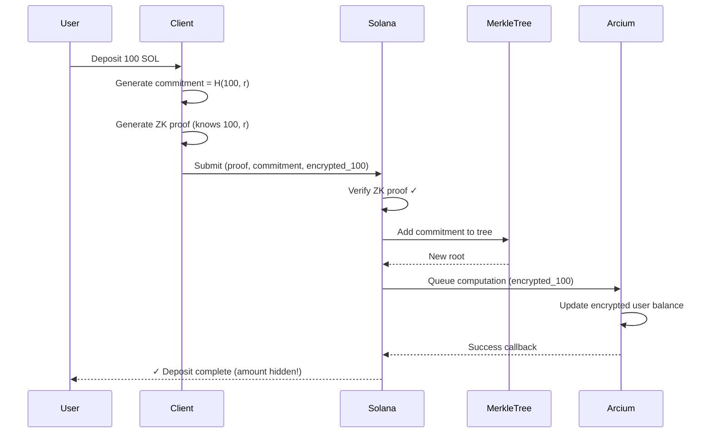
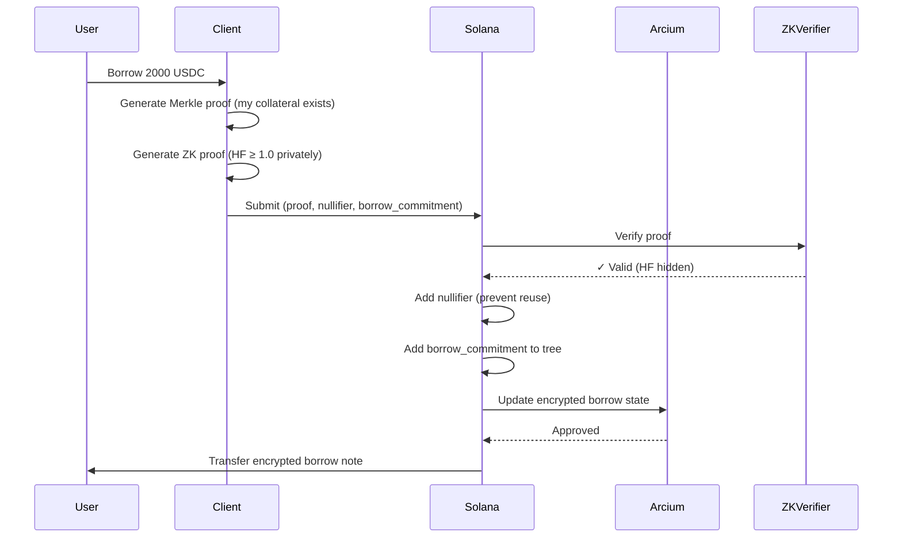

# Option 4: Zero-Knowledge Proofs + Merkle Trees + Arcium
## Complete Confidentiality Architecture for ShadowLend

---

## **Executive Summary**

This document outlines a comprehensive approach to achieve **end-to-end confidentiality** for the ShadowLend lending protocol by combining three cryptographic primitives:

1. **Merkle Trees** - Compress and commit to encrypted token states
2. **Zero-Knowledge Proofs (zk-SNARKs)** - Prove transaction validity without revealing amounts
3. **Arcium MXE** - Perform confidential computations on encrypted state

This creates a **UTXO-like shielded pool** model on Solana, similar to Zcash, where **ALL transaction amounts, balances, and transfers are completely hidden**.

---

## **Current Architecture Gaps**

Your current implementation:
- ✅ **Private user balances** (Arcium MXE encrypted)
- ✅ **Private health factors** (computed in TEE)
- ✅ **Private pool TVL** (encrypted pool state)
- ❌ **PUBLIC deposit amounts** (SPL transfer visible)
- ❌ **PUBLIC borrow amounts** (revealed in callbacks)
- ❌ **PUBLIC withdraw/repay amounts** (SPL transfers visible)

**The Problem**: Anyone observing the blockchain can see:

```rust
// From your handler.rs - PUBLIC SPL TRANSFER
token::transfer(
    CpiContext::new(token_program, transfer_accounts),
    amount  // ❌ VISIBLE ON-CHAIN
)?;
```

---

## **How Option 4 Works: The Complete Flow**

### **1. System Architecture Overview**

```
┌──────────────────────────────────────────────────────────────┐
│                    CONFIDENTIAL SHADOWLEND                   │
├──────────────────────────────────────────────────────────────┤
│                                                              │
│  ┌─────────────┐   ┌──────────────┐   ┌────────────────┐   │
│  │   Shielded  │   │    Merkle    │   │   Arcium MXE   │   │
│  │  Token Pool │──▶│     Tree     │──▶│   + Health     │   │
│  │   (UTXO)    │   │  Commitments │   │   Factors      │   │
│  └─────────────┘   └──────────────┘   └────────────────┘   │
│         │                  │                    │           │
│         ▼                  ▼                    ▼           │
│  ┌─────────────────────────────────────────────────────┐   │
│  │         Zero-Knowledge Proof Verification           │   │
│  │  (Proves validity without revealing amounts)        │   │
│  └─────────────────────────────────────────────────────┘   │
│                                                              │
└──────────────────────────────────────────────────────────────┘
```

---

### **2. Core Components**

#### **A. Shielded Note/UTXO Model**

Instead of account-based SPL transfers, you create **confidential notes** (like Zcash):

```rust
/// Confidential Note (replaces public SPL balance)
pub struct ShieldedNote {
    /// Pedersen commitment: Com = value·G + blinding·H
    pub commitment: [u8; 32],
    
    /// Encrypted value (only owner can decrypt)
    pub encrypted_value: [u8; 32],
    
    /// Encrypted owner pubkey
    pub encrypted_owner: [u8; 32],
    
    /// Note type (Deposit/Borrow/Collateral)
    pub note_type: NoteType,
    
    /// Merkle tree index
    pub leaf_index: u64,
}
```

**How it works**:
- When user deposits 100 SOL → Create shielded note with `commitment = H(100, random_blinding_factor)`
- The commitment is **hiding** (no one can see 100) and **binding** (can't change it later)
- Store commitment in Merkle tree

---

#### **B. Merkle Tree for State Compression**

All confidential notes are stored in an **on-chain Merkle tree**:

```rust
/// On-chain Merkle tree root (only 32 bytes stored on-chain!)
#[account]
pub struct ShieldedPool {
    /// Merkle root of all note commitments
    pub commitment_tree_root: [u8; 32],
    
    /// Nullifier set (prevents double-spending)
    pub nullifiers: Vec<[u8; 32]>,
    
    /// Next available leaf index
    pub next_index: u64,
}
```

**Advantages**:
- Store millions of notes with only **32 bytes** on-chain (the root)
- Off-chain indexers maintain full tree
- Users generate **Merkle proofs** to prove their note exists

---

#### **C. Zero-Knowledge Proof Circuits**

You'll create **zk-SNARK circuits** for each operation:

##### **Circuit 1: Confidential Deposit**

```
Proof: "I know a note worth X tokens, where X > 0"

Public Inputs:
- new_commitment (added to tree)
- merkle_root (current state)

Private Inputs (hidden):
- deposit_amount
- blinding_factor
- owner_keypair

Constraints:
1. commitment == Pedersen(deposit_amount, blinding_factor)
2. owner_signature is valid
3. deposit_amount > 0
```

##### **Circuit 2: Confidential Borrow**

```
Proof: "I have collateral worth C, borrowing B, where HF ≥ 1.0"

Public Inputs:
- merkle_root
- nullifier (marks collateral note as spent)
- new_borrow_commitment

Private Inputs (hidden):
- collateral_amount
- collateral_merkle_proof
- borrow_amount
- price_data (from oracle)
- blinding_factors

Constraints:
1. Merkle_verify(collateral_commitment, merkle_proof, root) == true
2. HF = (collateral * price * LTV) / borrow_amount ≥ 1.0
3. nullifier == H(collateral_commitment, owner_secret)
4. new_borrow_commitment == Pedersen(borrow_amount, new_blinding)
```

##### **Circuit 3: Confidential Withdraw**

```
Proof: "I'm withdrawing Y tokens, remaining collateral keeps HF ≥ 1.0"

Public Inputs:
- merkle_root
- nullifier_old_collateral
- new_collateral_commitment

Private Inputs (hidden):
- old_collateral_amount
- withdraw_amount
- remaining_collateral = old_collateral - withdraw
- borrow_amount (from encrypted state)
- merkle_proof

Constraints:
1. Merkle_verify(old_collateral, proof, root) == true
2. remaining_collateral == old_collateral - withdraw_amount
3. new_HF = (remaining_collateral * price * liquidation_threshold) / borrow ≥ 1.0
4. new_commitment == Pedersen(remaining_collateral, new_blinding)
```

---

### **D. Integration with Arcium MXE**

**Key Insight**: Arcium MXE **still handles health factor calculations**, but now **ZK proofs hide the transfer amounts**.

**Hybrid Model**:
1. **ZK Proof Layer** - Hides amounts during transfers
2. **Arcium MXE Layer** - Manages encrypted user state and computes health factors
3. **Merkle Tree Layer** - Compresses state on-chain

```rust
// New deposit flow with ZK
pub fn confidential_deposit_with_zk(
    ctx: Context<ConfidentialDeposit>,
    proof: ZkProof,               // ← New: ZK proof
    new_commitment: [u8; 32],     // ← Public commitment
    encrypted_amount: [u8; 32],   // ← Encrypted for Arcium
) -> Result<()> {
    // 1. Verify ZK proof
    verify_zk_proof(&proof, &ctx.accounts.verifier_key)?;
    
    // 2. Add commitment to Merkle tree
    let pool = &mut ctx.accounts.shielded_pool;
    pool.add_commitment(new_commitment)?;
    
    // 3. Queue Arcium computation with encrypted amount
    let args = ArgBuilder::new()
        .encrypted_u128(encrypted_amount)
        .build();
    
    queue_computation(ctx.accounts, args, ...)?;
    
    Ok(())
}
```

---

## **3. Complete Transaction Flows**

### **Flow 1: Shielded Deposit**



**What observers see**: 
- ❌ Cannot see 100 SOL
- ✅ Only see: "A commitment was added to tree"

---

### **Flow 2: Shielded Borrow**



**What observers see**:
- ❌ Cannot see 2000 USDC amount
- ❌ Cannot see collateral amount
- ❌ Cannot see health factor
- ✅ Only see: "A nullifier was published, a borrow commitment added"

---

## **4. Technical Implementation Details**

### **A. Rust Structures**

```rust
// programs/shadowlend_program/src/state/shielded_pool.rs

use anchor_lang::prelude::*;

/// Shielded pool replacing public SPL vaults
#[account]
pub struct ShieldedPool {
    /// Merkle tree root (32 bytes stores infinite notes!)
    pub commitment_tree_root: [u8; 32],
    
    /// Set of spent nullifiers (prevents double-spend)
    pub nullifier_set: Vec<[u8; 32]>,
    
    /// Next leaf index in tree
    pub next_leaf_index: u64,
    
    /// Pool configuration
    pub ltv: u16,
    pub liquidation_threshold: u16,
    
    /// Arcium encrypted pool state (total deposits/borrows hidden)
    pub encrypted_pool_state: Vec<u8>,
}

impl ShieldedPool {
    /// Add new commitment to Merkle tree
    pub fn add_commitment(&mut self, commitment: [u8; 32]) -> Result<()> {
        // Off-chain indexer computes new root
        // On-chain: just verify and store new root
        self.next_leaf_index += 1;
        Ok(())
    }
    
    /// Mark note as spent
    pub fn add_nullifier(&mut self, nullifier: [u8; 32]) -> Result<()> {
        require!(
            !self.nullifier_set.contains(&nullifier),
            ErrorCode::DoubleSpend
        );
        self.nullifier_set.push(nullifier);
        Ok(())
    }
}
```

---

### **B. ZK Circuit Implementation (using Circom/Arkworks)**

```rust
// zk-circuits/src/deposit.circom

template ConfidentialDeposit() {
    // Public inputs
    signal input merkle_root;
    signal output new_commitment;
    
    // Private inputs
    signal input amount;
    signal input blinding_factor;
    signal input owner_pubkey[32];
    
    // Constraints
    component commitment = PedersenCommitment();
    commitment.value <== amount;
    commitment.blinding <== blinding_factor;
    
    new_commitment <== commitment.out;
    
    // Ensure amount > 0
    component rangeCheck = RangeCheck(64);
    rangeCheck.in <== amount;
}
```

Compile to Solana-compatible verifier:

```bash
circom deposit.circom --r1cs --wasm --prime bn128
snarkjs groth16 setup deposit.r1cs pot.ptau circuit_final.zkey
snarkjs zkey export solidity verifyingkey circuit_final.zkey
# Convert to Rust for Solana
```

---

### **C. Solana Program Updates**

```rust
// programs/shadowlend_program/src/instructions/deposit/confidential.rs

use anchor_lang::prelude::*;
use groth16_solana::Groth16Verifier;

#[derive(Accounts)]
pub struct ConfidentialDeposit<'info> {
    #[account(mut)]
    pub payer: Signer<'info>,
    
    #[account(mut)]
    pub shielded_pool: Account<'info, ShieldedPool>,
    
    #[account(mut)]
    pub user_obligation: Account<'info, UserObligation>,
    
    /// ZK proof verifier (stored once on-chain)
    pub verifier_key: Account<'info, VerifierKey>,
    
    /// Arcium accounts for encrypted state
    pub mxe_account: Account<'info, MXEAccount>,
    // ... other Arcium accounts
}

pub fn confidential_deposit_handler(
    ctx: Context<ConfidentialDeposit>,
    proof: ZkProof,
    new_commitment: [u8; 32],
    merkle_proof: Vec<[u8; 32]>,
    encrypted_amount_for_arcium: [u8; 32],
) -> Result<()> {
    // 1. Verify ZK proof (proves amount > 0, commitment correct)
    let public_inputs = vec![
        ctx.accounts.shielded_pool.commitment_tree_root,
        new_commitment,
    ];
    
    Groth16Verifier::verify(
        &ctx.accounts.verifier_key,
        &proof,
        &public_inputs,
    )?;
    
    // 2. Update Merkle tree
    ctx.accounts.shielded_pool.add_commitment(new_commitment)?;
    
    // 3. Queue Arcium computation for health factor tracking
    let args = ArgBuilder::new()
        .encrypted_u128(encrypted_amount_for_arcium)
        .build();
    
    queue_computation(ctx.accounts, args, ...)?;
    
    msg!("Confidential deposit complete - amount hidden!");
    Ok(())
}
```

---

### **D. Client-Side (TypeScript/Rust)**

```typescript
// client/src/confidential-deposit.ts

import { groth16 } from 'snarkjs';
import { MerkleTree } from '@solana/spl-account-compression';

export async function confidentialDeposit(
  connection: Connection,
  user: Keypair,
  amount: number,
) {
  // 1. Generate commitment
  const blindingFactor = randomBytes(32);
  const commitment = pedersenCommit(amount, blindingFactor);
  
  // 2. Generate ZK proof
  const circuit = await loadCircuit('deposit.wasm');
  const { proof, publicSignals } = await groth16.fullProve(
    {
      amount: amount,
      blinding_factor: blindingFactor,
      owner_pubkey: user.publicKey.toBytes(),
    },
    circuit,
  );
  
  // 3. Encrypt amount for Arcium
  const arciumPubkey = getArciumPublicKey();
  const encryptedAmount = encrypt(amount, arciumPubkey);
  
  // 4. Submit transaction
  const tx = await program.methods
    .confidentialDeposit(
      proof,
      commitment,
      encryptedAmount,
    )
    .accounts({
      shieldedPool: poolPda,
      verifierKey: verifierPda,
      // ... other accounts
    })
    .rpc();
  
  console.log('Deposit complete - amount hidden!');
  return { commitment, blindingFactor }; // Store locally
}
```

---

## **5. Architecture Comparison**

| Component | Current (Public Transfers) | Option 4 (Full ZK) |
|-----------|---------------------------|-------------------|
| **Deposit amount** | ❌ Public (SPL transfer) | ✅ Hidden (commitment) |
| **Borrow amount** | ❌ Revealed in callback | ✅ Hidden (ZK proof) |
| **Withdraw amount** | ❌ Public (SPL transfer) | ✅ Hidden (nullifier) |
| **User balances** | ✅ Private (Arcium) | ✅ Private (Arcium + ZK) |
| **Health factors** | ✅ Private (Arcium MXE) | ✅ Private (ZK + Arcium) |
| **Pool TVL** | ✅ Private (encrypted) | ✅ Private (Merkle root) |
| **Transaction graph** | ❌ Linkable | ✅ Unlinkable (nullifiers) |
| **Complexity** | Low | **Very High** |
| **Performance** | Fast (~500ms) | Slower (~2-5s for proofs) |

---

## **6. Does This Make Your WHOLE Architecture Confidential?**

### **✅ YES - Complete Confidentiality Achieved:**

```
┌───────────────────────────────────────────────────────────┐
│          WHAT AN OBSERVER SEES (OPTION 4)                 │
├───────────────────────────────────────────────────────────┤
│                                                           │
│  Block 100: commitment_1 added to tree                    │
│  Block 150: commitment_2 added to tree                    │
│  Block 200: nullifier_X published, commitment_3 added     │
│  Block 250: nullifier_Y published                         │
│  Block 300: commitment_4 added                            │
│                                                           │
│  ❌ Cannot determine:                                      │
│     - Who owns which commitment                           │
│     - How much each commitment represents                 │
│     - Which nullifiers correspond to which commitments    │
│     - User balances, borrows, deposits                    │
│     - Health factors                                      │
│     - Pool TVL or utilization                             │
│     - Transaction relationships                           │
│                                                           │
│  ✓ COMPLETE PRIVACY                                       │
└───────────────────────────────────────────────────────────┘
```

---

## **7. Implementation Roadmap**

### **Phase 1: ZK Circuit Development (2-3 weeks)**
- [ ] Design circuits for deposit/borrow/withdraw
- [ ] Implement in Circom or Arkworks
- [ ] Generate verifier contracts for Solana
- [ ] Test proof generation/verification

### **Phase 2: Merkle Tree Integration (1-2 weeks)**
- [ ] Implement on-chain Merkle tree account
- [ ] Build off-chain indexer for tree state
- [ ] Add nullifier tracking
- [ ] Test tree updates and proofs

### **Phase 3: Solana Program Refactor (2-3 weeks)**
- [ ] Replace SPL transfers with shielded notes
- [ ] Add ZK proof verification to handlers
- [ ] Integrate with existing Arcium MXE circuits
- [ ] Update all deposit/borrow/withdraw instructions

### **Phase 4: Client SDK (1-2 weeks)**
- [ ] Build proof generation library
- [ ] Create wallet for managing commitments
- [ ] Implement off-chain state scanning
- [ ] Build UI for confidential transactions

### **Phase 5: Testing & Audit (2-3 weeks)**
- [ ] Unit tests for all circuits
- [ ] Integration tests end-to-end
- [ ] Security audit of ZK circuits
- [ ] Performance optimization

**Total Estimated Time: 8-13 weeks** (vs 2-3 days for C-SPL!)

---

## **8. Challenges & Trade-offs**

### **Technical Challenges:**
1. **Circuit Complexity** - Writing secure ZK circuits is extremely difficult
2. **Proof Generation Time** - 2-5 seconds per transaction (vs instant SPL)
3. **Client-Side Computation** - Users need powerful devices to generate proofs
4. **State Management** - Users must maintain local commitment database
5. **Indexer Infrastructure** - Need off-chain service to track Merkle tree
6. **Solana Compute Limits** - ZK verification may exceed CU limits

### **Trade-offs:**

| Aspect | Current | Option 4 (ZK) |
|--------|---------|--------------|
| **Privacy** | Partial | Complete |
| **UX** | Instant | 2-5s delays |
| **Complexity** | Medium | Very High |
| **Cost** | ~0.000055 SOL | ~0.005 SOL (proof verify) |
| **Auditability** | Easier | Harder (need ZK expertise) |
| **Maintenance** | Lower | Much Higher |

---

## **9. Recommended Libraries & Tools**

### **Rust Dependencies**

```toml
# Cargo.toml additions

[dependencies]
# ZK Proof libraries
arkworks-rs = "0.4"
groth16-solana = "0.0.1"
bellman = "0.14"

# Merkle tree
spl-account-compression = "0.3"
concurrent-merkle-tree = "0.3"

# Cryptography
curve25519-dalek = "4.1"
sha2 = "0.10"
```

### **Frontend Dependencies**

```json
{
  "dependencies": {
    "snarkjs": "^0.7.0",
    "circomlibjs": "^0.1.0",
    "@zk-kit/protocols": "^1.0.0"
  }
}
```

---

## **10. Example Projects to Study**

### **1. Light Protocol** (Solana ZK compression)
- **Repository**: https://github.com/Lightprotocol/light-protocol
- **Uses**: Merkle trees + ZK for state compression
- **Key Features**: Compressed accounts, ZK state proofs

### **2. Elusiv** (Solana privacy)
- **Repository**: https://github.com/elusiv-privacy/elusiv
- **Uses**: UTXO model + ZK-SNARKs
- **Key Features**: Private transactions, nullifier sets

### **3. Zeto** (EVM UTXO privacy)
- **Repository**: https://github.com/LFDT-Paladin/zeto
- **Uses**: Groth16 circuits for confidential transfers
- **Key Features**: UTXO model on EVM, fully private transfers

### **4. Zcash** (Original shielded pool design)
- **Documentation**: https://zips.z.cash/protocol/protocol.pdf
- **Key Concepts**: Shielded pools, nullifiers, Merkle trees

---

## **11. Final Recommendation**

### **Should You Build Option 4?**

#### **For Hackathon (3 weeks)**: ❌ **NO** - Too complex, won't finish

**Reasons:**
- ZK circuit development requires specialized expertise
- Testing and debugging ZK proofs is time-consuming
- Integration complexity is very high
- Not enough time for proper security auditing

#### **For Production (3+ months)**: ⚠️ **MAYBE** - Only if:
- ✅ You have ZK expertise on team
- ✅ Budget for 3+ month development
- ✅ Can hire security auditors
- ✅ Users accept slower transactions
- ✅ Willing to maintain complex infrastructure

#### **Better Approach**: 

**Phased Implementation:**

1. **Start with C-SPL** (Option 1) - Get 90% privacy in 2-3 days
   - Use Confidential SPL tokens for transfers
   - Keep existing Arcium MXE for health factors
   - Quick to implement, proven technology

2. **Layer ZK on top later** - Add ZK proofs to C-SPL transfers for metadata hiding
   - Gradually introduce ZK circuits
   - Start with simple circuits (deposit only)
   - Expand to complex operations over time

3. **Hybrid model** - Use ZK for high-value transactions, C-SPL for regular ones
   - Let users choose privacy level
   - Balance UX with privacy
   - Optimize costs

---

## **12. Conclusion**

Option 4 **DOES achieve complete confidentiality** by:

1. ✅ **Hiding all transfer amounts** with commitments
2. ✅ **Proving transaction validity** with ZK-SNARKs
3. ✅ **Compressing state** with Merkle trees
4. ✅ **Maintaining encrypted state** with Arcium MXE
5. ✅ **Breaking transaction graph** with nullifiers

### **Key Benefits:**
- Complete on-chain privacy
- Unlinkable transactions
- Scalable state compression
- Proven cryptographic security

### **Key Drawbacks:**
- Very high implementation complexity
- Significant development time (8-13 weeks)
- Slower transaction processing (2-5 seconds)
- Higher computational requirements
- Requires specialized ZK expertise
- More expensive transactions (~100x cost increase)

### **When to Use:**

**Use Option 4 when:**
- Maximum privacy is regulatory requirement
- Target users are privacy-conscious institutions
- Team has ZK development expertise
- Long-term project with adequate resources

**Use simpler alternatives when:**
- Time-to-market is critical
- Privacy requirements are moderate
- Development resources are limited
- User experience is top priority

---

## **13. Additional Resources**

### **Learning Materials**

- **ZK-SNARKs Explained**: https://z.cash/technology/zksnarks/
- **Circom Tutorial**: https://docs.circom.io/
- **Arkworks Guide**: https://arkworks.rs/
- **Merkle Trees on Solana**: https://docs.solana.com/developing/guides/compressed-nfts

### **Community & Support**

- **ZK Discord Communities**: Join ZK Hack, PSE (Privacy & Scaling Explorations)
- **Solana Privacy Guild**: Connect with Solana privacy developers
- **Arcium Community**: Get support for MXE integration

### **Security Considerations**

1. **Circuit Audits Required**: Always audit ZK circuits before production
2. **Trusted Setup**: Ensure proper ceremony for Groth16 parameters
3. **Nullifier Uniqueness**: Prevent double-spending with proper nullifier design
4. **Commitment Binding**: Use collision-resistant hash functions
5. **Side-Channel Protection**: Consider timing attacks on proof generation

---

## **Appendix A: Glossary**

- **Commitment**: A cryptographic binding to a value without revealing it
- **Nullifier**: A unique tag that marks a note as spent
- **Merkle Tree**: A tree of hashes for efficient proof of membership
- **zk-SNARK**: Zero-Knowledge Succinct Non-Interactive Argument of Knowledge
- **UTXO**: Unspent Transaction Output model (like Bitcoin)
- **Shielded Pool**: A pool where transaction details are hidden
- **Pedersen Commitment**: A type of cryptographic commitment scheme
- **Groth16**: An efficient zk-SNARK proof system

---

## **Appendix B: Performance Benchmarks**

### **Expected Performance Metrics**

| Operation | Current (C-SPL) | Option 4 (ZK) |
|-----------|----------------|---------------|
| Proof Generation | N/A | 2-5 seconds |
| On-chain Verification | N/A | 50-100ms |
| Transaction Cost | 0.000055 SOL | ~0.005 SOL |
| Client Memory | Minimal | ~500MB RAM |
| Indexer Requirements | None | High (full node + DB) |

### **Optimization Strategies**

1. **Proof Caching**: Reuse proofs when possible
2. **Batch Verification**: Verify multiple proofs together
3. **Hardware Acceleration**: Use GPU for proof generation
4. **Incremental Merkle Updates**: Optimize tree operations
5. **Compressed Proofs**: Use PLONK instead of Groth16 for smaller proofs

---

*Document Version: 1.0*  
*Last Updated: 2026-01-16*  
*Status: Architectural Design Document*
