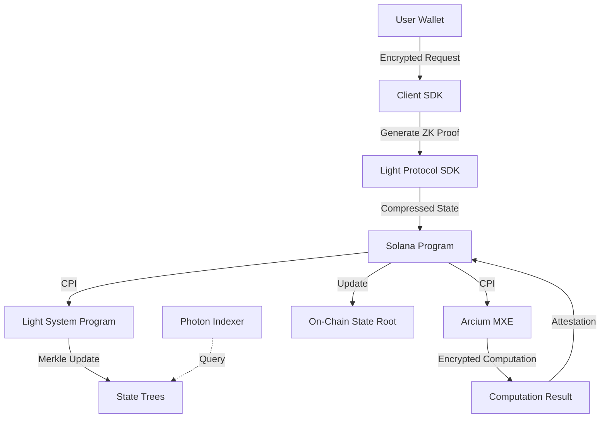
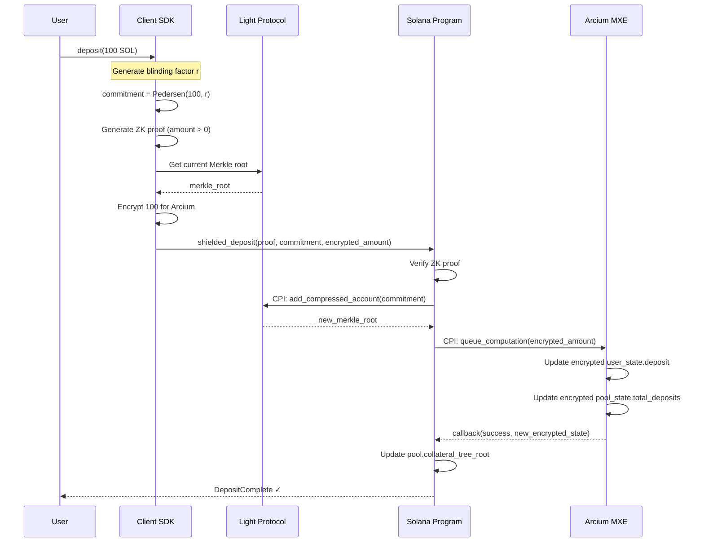
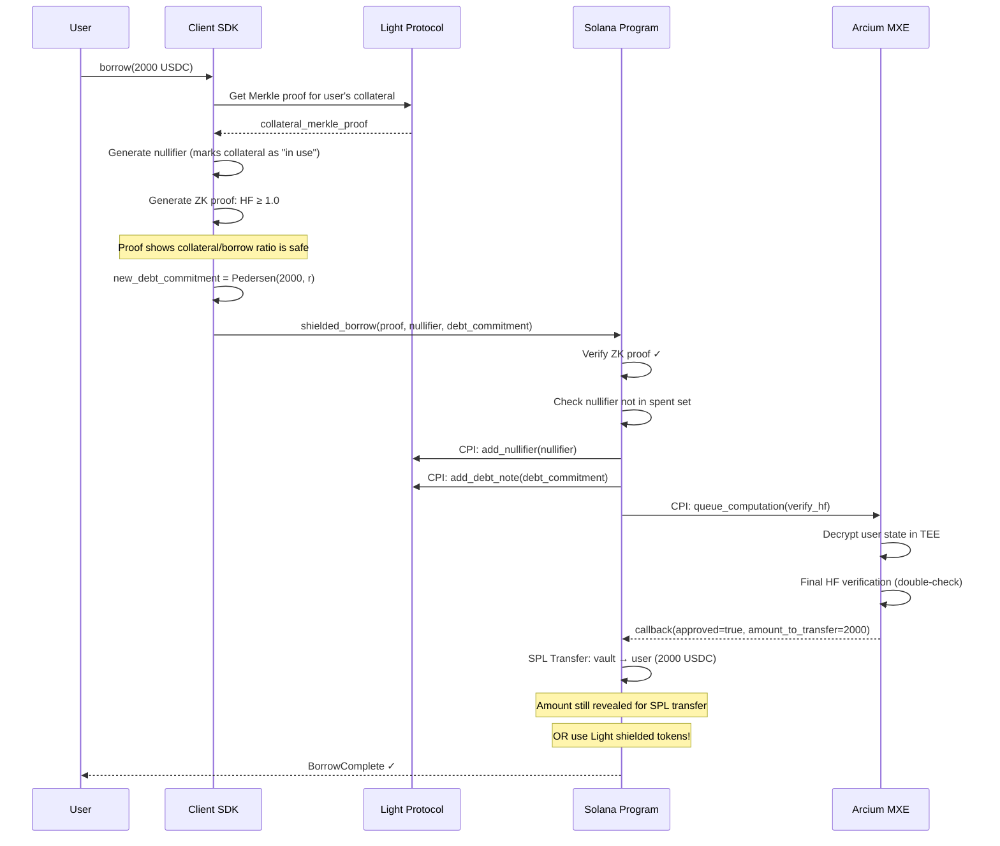
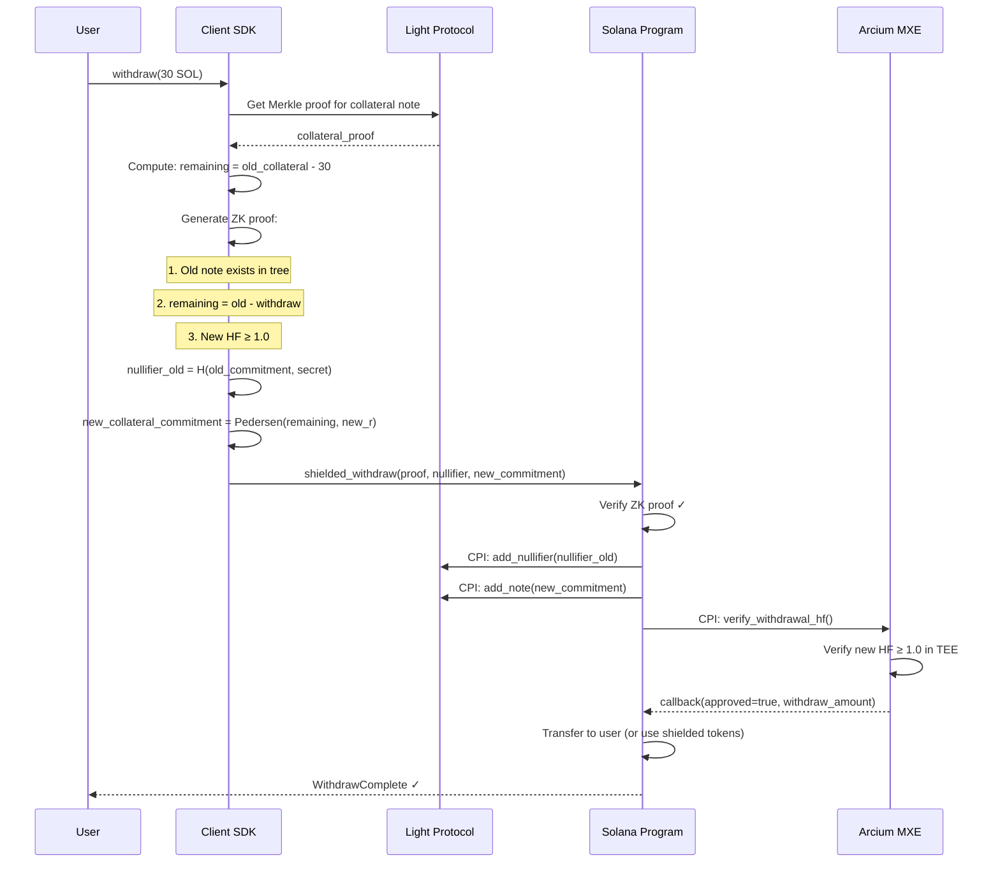
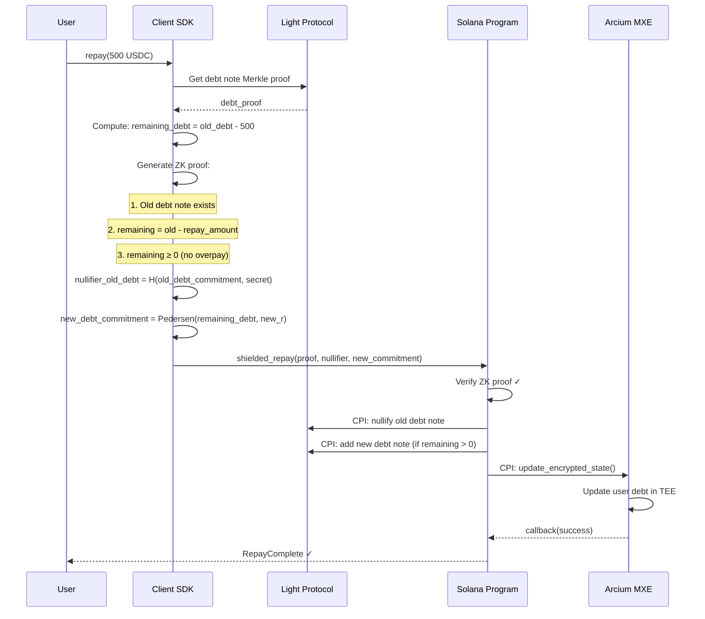
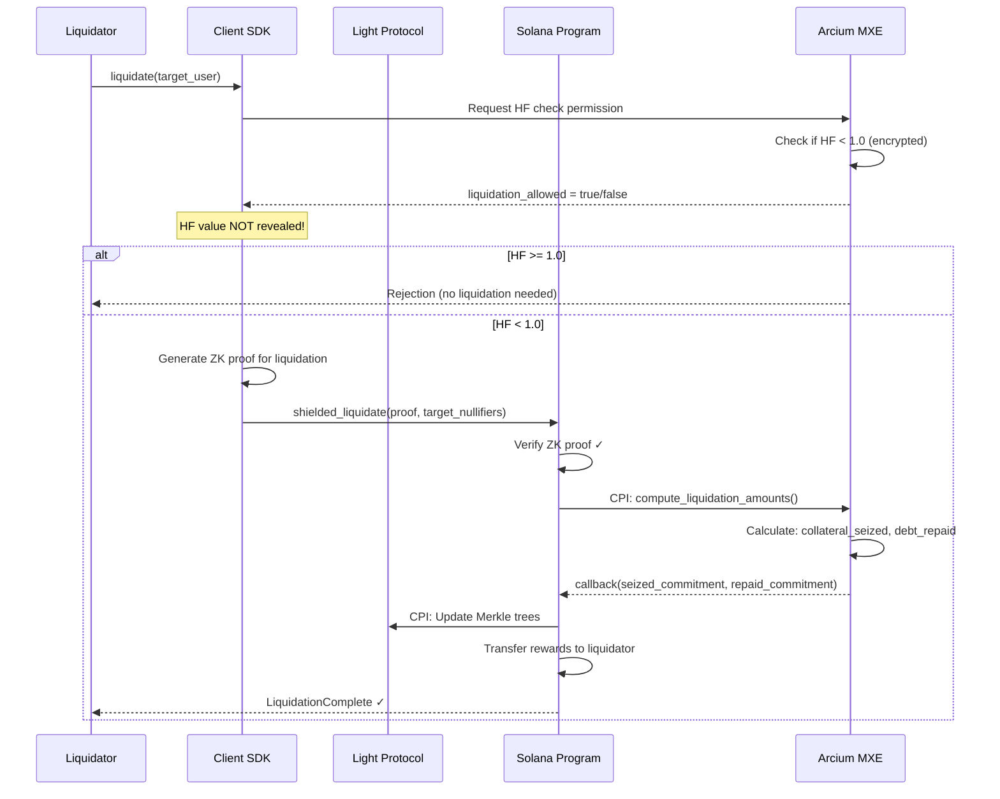

# ShadowLend V2: Light Protocol ZK Compression + Arcium Integration
## Complete Confidentiality Architecture with Cost Optimization

---

## **Executive Summary**

This document outlines how to achieve **complete transaction confidentiality** at **5000x lower storage cost** by integrating:

1. **Light Protocol ZK Compression** - Cheap storage, pre-built Merkle trees, optimized proofs
2. **Light Protocol Shielded Pools** - UTXO model, nullifiers, hidden amounts
3. **Arcium MXE** - Confidential health factor computations

**Key Benefits vs Custom ZK (Option 4):**

| Metric | Custom ZK | Light Protocol + Arcium |
|--------|-----------|------------------------|
| Storage Cost | ~0.002 SOL/account | **~0.00004 SOL/account** |
| Proof Time | 2-5 seconds | **~200-500ms** |
| TX Cost | ~0.005 SOL | **~0.0001 SOL** |
| Dev Time | 8-13 weeks | **4-7 weeks** |
| Complexity | Very High | Medium-High |
| Privacy | Full | Full |

---

## **1. Current Architecture Gap Analysis**

### Current ShadowLend V1 Privacy Model (Arcium Only)

```
PUBLIC (Visible to all observers):
├── Deposit amounts (SPL transfers)
├── Borrow amounts (revealed in callbacks)
├── Withdraw amounts (revealed in callbacks)
├── Repay amounts (SPL transfers)
└── Liquidation amounts (revealed)

PRIVATE (Hidden via Arcium MXE):
├── User balances (Enc<Shared, UserState>)
├── Health factors (computed in TEE)
├── Pool TVL (Enc<Mxe, PoolState>)
├── Interest accrual (computed in TEE)
└── Collateralization ratios
```

**The Problem:** While user positions are private, **all transaction amounts are public** on-chain.

### Target: ShadowLend V2 (Light + Arcium)

```
PRIVATE (Everything hidden!):
├── ✅ Deposit amounts (shielded notes)
├── ✅ Borrow amounts (ZK proofs)
├── ✅ Withdraw amounts (nullifiers)
├── ✅ Repay amounts (shielded transfers)
├── ✅ Liquidation amounts (ZK privacy)
├── ✅ User balances (Arcium + Light)
├── ✅ Health factors (Arcium MXE)
├── ✅ Pool TVL (compressed state)
└── ✅ Transaction linkability (nullifiers break graph)
```

---

## **2. Light Protocol Architecture**

### 2.1 How Light Protocol's ZK Compression Works

```
Traditional Solana:                    Light Protocol:
┌──────────────────┐                  ┌──────────────────┐
│  Account 1       │                  │  State Root      │
│  ├── Balance: 100│                  │  (32 bytes)      │
│  └── Owner: Alice│                  │                  │
├──────────────────┤                  │  Stores MILLIONS │
│  Account 2       │                  │  of accounts!    │
│  ├── Balance: 50 │    ────────►    │                  │
│  └── Owner: Bob  │                  │  Off-chain data: │
├──────────────────┤                  │  ├── Photon      │
│  Account 3       │                  │  │   Indexer     │
│  ├── Balance: 200│                  │  └── Forester    │
│  └── Owner: Carol│                  │      Nodes       │
└──────────────────┘                  └──────────────────┘
Cost: ~0.002 SOL each                 Cost: ~0.00004 SOL total!
```

### 2.2 Shielded Pool Model (UTXO)

Light Protocol pioneered **UTXO-style shielded pools** on Solana:

```rust
/// Shielded Note (replaces SPL token account)
pub struct ShieldedNote {
    /// Pedersen commitment: Com = value·G + blinding·H
    pub commitment: [u8; 32],
    
    /// Encrypted value (only owner can decrypt)
    pub encrypted_value: [u8; 32],
    
    /// Note type
    pub note_type: NoteType,  // Collateral, Borrow, etc.
    
    /// Nullifier (for spending)
    pub nullifier_hash: [u8; 32],
}

pub enum NoteType {
    Collateral,     // Deposited collateral
    BorrowDebt,     // Outstanding borrow
    Interest,       // Accrued interest
}
```

### 2.3 Key Components

| Component | Purpose | Provider |
|-----------|---------|----------|
| **Compressed Accounts** | Cheap state storage | Light SDK |
| **State Trees** | Merkle tree management | Light SDK |
| **Photon Indexer** | Off-chain state queries | Helius Labs |
| **Forester Nodes** | Tree maintenance | Light Network |
| **Shielded Tokens** | Private transfers | Light SDK (privacy mode) |
| **ZK Proof Verifier** | On-chain proof verification | Light System Program |

---

## **3. Three-Layer Privacy Stack**

```
┌─────────────────────────────────────────────────────────────────┐
│                   SHADOWLEND V2 PRIVACY STACK                    │
├─────────────────────────────────────────────────────────────────┤
│                                                                  │
│  Layer 3: ARCIUM MXE (Confidential Computation)                 │
│  ┌──────────────────────────────────────────────────────────┐   │
│  │ Responsibility:                                           │   │
│  │ • Health factor calculations on encrypted state          │   │
│  │ • Interest rate computations                              │   │
│  │ • Liquidation threshold checks                            │   │
│  │ • Complex multi-party computations                        │   │
│  │                                                            │   │
│  │ WHY NEEDED: Light Protocol can't do arbitrary encrypted   │   │
│  │ computation - Arcium's TEE handles this                   │   │
│  └──────────────────────────────────────────────────────────┘   │
│                            ▲                                     │
│                            │ (encrypted state)                   │
│                            │                                     │
│  Layer 2: LIGHT SHIELDED POOLS (Private Transfers)              │
│  ┌──────────────────────────────────────────────────────────┐   │
│  │ Responsibility:                                           │   │
│  │ • Hide deposit amounts (Pedersen commitments)            │   │
│  │ • Hide borrow amounts (ZK proofs)                        │   │
│  │ • Hide withdrawal amounts (nullifiers)                   │   │
│  │ • Break transaction linkability                          │   │
│  │                                                            │   │
│  │ WHY NEEDED: Pre-built UTXO model, audited circuits       │   │
│  └──────────────────────────────────────────────────────────┘   │
│                            ▲                                     │
│                            │ (state roots)                       │
│                            │                                     │
│  Layer 1: LIGHT ZK COMPRESSION (Cheap Storage)                  │
│  ┌──────────────────────────────────────────────────────────┐   │
│  │ Responsibility:                                           │   │
│  │ • Store user obligations off-chain (32-byte root)        │   │
│  │ • Merkle tree management                                  │   │
│  │ • Nullifier set compression                               │   │
│  │ • Proof generation + verification                         │   │
│  │                                                            │   │
│  │ WHY NEEDED: 5000x cheaper than regular accounts          │   │
│  └──────────────────────────────────────────────────────────┘   │
│                                                                  │
└─────────────────────────────────────────────────────────────────┘
```

---

## **4. Data Flow Architecture**

### 4.1 High-Level Flow



### 4.2 Account Structure Comparison

```rust
// ============================================================
// OLD: V1 Account (Public transfers, Private state)
// ============================================================

pub struct Pool {          // ~400 bytes on-chain
    pub authority: Pubkey,
    pub collateral_mint: Pubkey,
    pub borrow_mint: Pubkey,
    pub encrypted_pool_state: Vec<u8>,  // Arcium encrypted
    pub ltv: u16,
    pub liquidation_threshold: u16,
    // ...
}

pub struct UserObligation {  // ~320 bytes on-chain per user!
    pub user: Pubkey,
    pub pool: Pubkey,
    pub encrypted_state_blob: Vec<u8>,  // Arcium encrypted
    pub total_funded: u64,
    pub total_claimed: u64,
    // ...
}

// ============================================================
// NEW: V2 Account (Full privacy + Compressed storage)
// ============================================================

pub struct ShieldedPool {      // Only ~100 bytes on-chain!
    pub authority: Pubkey,
    pub collateral_mint: Pubkey,
    pub borrow_mint: Pubkey,
    
    // Light Protocol compressed state roots
    pub collateral_tree_root: [u8; 32],  // Merkle root of all collateral notes
    pub debt_tree_root: [u8; 32],        // Merkle root of all debt notes
    pub nullifier_tree_root: [u8; 32],   // Merkle root of spent nullifiers
    
    // Risk parameters (still public for transparency)
    pub ltv: u16,
    pub liquidation_threshold: u16,
    pub liquidation_bonus: u16,
    
    // Arcium-encrypted pool aggregates
    pub encrypted_pool_state: [u8; 64],
    
    pub bump: u8,
}

// User state is now ENTIRELY off-chain (compressed!)
// Only referenced via Merkle proofs
pub struct CompressedUserNote {  // Stored in Merkle tree (off-chain)
    /// PDA-like identifier
    pub user: Pubkey,
    pub pool: Pubkey,
    
    /// Shielded collateral note commitment
    pub collateral_commitment: [u8; 32],
    pub collateral_encrypted: [u8; 32],  // User can decrypt
    
    /// Shielded debt note commitment
    pub debt_commitment: [u8; 32],
    pub debt_encrypted: [u8; 32],        // User can decrypt
    
    /// Arcium encrypted state (for MXE computations)
    pub arcium_state_ciphertext: [u8; 64],
    
    /// Merkle context for proofs
    pub leaf_index: u64,
}
```

---

## **5. Transaction Flows (All 6 Operations)**

### 5.1 Confidential Deposit

**Goal:** Hide deposit amount while updating encrypted balance



**What observers see:**
```
❌ Cannot see: 100 SOL deposit amount
❌ Cannot see: User's total balance
❌ Cannot see: Pool TVL change
✅ Only see: "A commitment was added to tree"
```

**Client-side Implementation:**

```typescript
import { 
    Rpc, 
    createRpc,
    CompressedAccountWithMerkleContext 
} from "@lightprotocol/stateless.js";
import { pedersenCommit, generateProof } from "./crypto";

async function shieldedDeposit(
    connection: Rpc,
    user: Keypair,
    amount: number,
    pool: PublicKey,
) {
    // 1. Generate cryptographic commitment
    const blindingFactor = randomBytes(32);
    const commitment = pedersenCommit(amount, blindingFactor);
    
    // 2. Generate ZK proof (proves amount > 0 without revealing it)
    const proof = await generateProof({
        circuit: "deposit",
        privateInputs: {
            amount,
            blindingFactor,
            ownerPubkey: user.publicKey.toBytes(),
        },
        publicInputs: {
            commitment,
        },
    });
    
    // 3. Encrypt amount for Arcium (for health factor tracking)
    const arciumEncrypted = await encryptForArcium(amount, pool);
    
    // 4. Get current Merkle context from Light Protocol
    const merkleContext = await connection.getCompressedAccountProof(
        user.publicKey
    );
    
    // 5. Submit shielded deposit
    const tx = await program.methods
        .shieldedDeposit(
            proof,
            Array.from(commitment),
            Array.from(arciumEncrypted),
        )
        .accounts({
            payer: user.publicKey,
            shieldedPool: poolPda,
            lightSystemProgram: LIGHT_SYSTEM_PROGRAM_ID,
            registeredProgramPda: registeredProgramPda,
            arciumMxe: arciumMxePda,
        })
        .remainingAccounts(merkleContext.accounts)
        .rpc();
    
    // 6. Store locally for future proofs
    return {
        commitment,
        blindingFactor,
        leafIndex: merkleContext.leafIndex,
    };
}
```

---

### 5.2 Confidential Borrow

**Goal:** Borrow tokens after privately proving health factor ≥ 1.0



**Privacy Enhancement - Fully Shielded Borrow:**

To make the borrow output ALSO private, use Light's shielded tokens:

```rust
// Instead of regular SPL transfer:
token::transfer(vault, user, amount)?;

// Use shielded token mint:
light_compressed_token::shield_tokens(
    vault_compressed_account,
    user_shielded_account,
    debt_commitment,  // Amount hidden in commitment
)?;
```

---

### 5.3 Confidential Withdraw

**Goal:** Withdraw collateral while keeping remaining balance + HF private



---

### 5.4 Confidential Repay

**Goal:** Repay debt without revealing payment amount



---

### 5.5 Confidential Liquidation

**Goal:** Liquidate undercollateralized position without revealing HF or exact amounts



**Privacy Note:** Even the liquidator only knows:
- ❌ NOT the exact HF value
- ❌ NOT the user's total position
- ✅ Only that liquidation was approved/denied

---

### 5.6 Confidential Interest Accrual

**Goal:** Already private in V1, enhanced with compressed storage in V2

```rust
// Interest computation happens entirely in Arcium MXE
// No ZK proof needed - just encrypted state update

pub fn update_interest(
    ctx: Context<UpdateInterest>,
    user: Pubkey,
) -> Result<()> {
    // 1. Get user's compressed note from Merkle tree
    let merkle_proof = ctx.accounts.merkle_proof;
    
    // 2. Queue Arcium computation
    let args = ArgBuilder::new()
        .pubkey(user)
        .i64(Clock::get()?.unix_timestamp)
        .build();
    
    queue_computation(
        ctx.accounts.arcium_accounts,
        COMP_DEF_OFFSET_COMPUTE_INTEREST,
        args,
    )?;
    
    // Arcium MXE computes:
    // interest = borrow_amount × rate × time_elapsed
    // new_borrow = old_borrow + interest
    // Returns: encrypted new state
    
    Ok(())
}
```

---

## **6. On-Chain Program Structure**

### 6.1 New Instruction Set

```rust
// programs/shadowlend_program/src/lib.rs

use anchor_lang::prelude::*;
use light_sdk::*;
use arcium_anchor::prelude::*;

#[program]
pub mod shadowlend_v2 {
    use super::*;

    // ============================================================
    // Admin Instructions
    // ============================================================
    
    pub fn initialize_shielded_pool(
        ctx: Context<InitializeShieldedPool>,
        ltv: u16,
        liquidation_threshold: u16,
        liquidation_bonus: u16,
    ) -> Result<()> {
        instructions::admin::initialize_shielded_pool(...)
    }

    // ============================================================
    // Shielded Deposit
    // ============================================================
    
    pub fn shielded_deposit(
        ctx: Context<ShieldedDeposit>,
        proof: CompressedProof,
        commitment: [u8; 32],
        encrypted_amount: [u8; 32],
    ) -> Result<()> {
        instructions::deposit::shielded_deposit_handler(...)
    }
    
    pub fn shielded_deposit_callback(
        ctx: Context<ShieldedDepositCallback>,
        output: SignedComputationOutputs<DepositOutput>,
    ) -> Result<()> {
        instructions::deposit::shielded_deposit_callback(...)
    }

    // ============================================================
    // Shielded Borrow
    // ============================================================
    
    pub fn shielded_borrow(
        ctx: Context<ShieldedBorrow>,
        proof: CompressedProof,
        nullifier: [u8; 32],
        debt_commitment: [u8; 32],
        encrypted_borrow_amount: [u8; 32],
    ) -> Result<()> {
        instructions::borrow::shielded_borrow_handler(...)
    }

    // ============================================================
    // Shielded Withdraw
    // ============================================================
    
    pub fn shielded_withdraw(
        ctx: Context<ShieldedWithdraw>,
        proof: CompressedProof,
        old_nullifier: [u8; 32],
        new_collateral_commitment: [u8; 32],
        encrypted_withdraw_amount: [u8; 32],
    ) -> Result<()> {
        instructions::withdraw::shielded_withdraw_handler(...)
    }

    // ============================================================
    // Shielded Repay
    // ============================================================
    
    pub fn shielded_repay(
        ctx: Context<ShieldedRepay>,
        proof: CompressedProof,
        old_debt_nullifier: [u8; 32],
        new_debt_commitment: [u8; 32],
        encrypted_repay_amount: [u8; 32],
    ) -> Result<()> {
        instructions::repay::shielded_repay_handler(...)
    }

    // ============================================================
    // Shielded Liquidation
    // ============================================================
    
    pub fn shielded_liquidate(
        ctx: Context<ShieldedLiquidate>,
        proof: CompressedProof,
        target_collateral_nullifier: [u8; 32],
        target_debt_nullifier: [u8; 32],
    ) -> Result<()> {
        instructions::liquidate::shielded_liquidate_handler(...)
    }

    // ============================================================
    // Interest (unchanged - already private)
    // ============================================================
    
    pub fn update_interest(
        ctx: Context<UpdateInterest>,
        target_user: Pubkey,
    ) -> Result<()> {
        instructions::interest::update_interest_handler(...)
    }
}
```

### 6.2 Account Contexts

```rust
// programs/shadowlend_program/src/instructions/deposit/shielded_accounts.rs

use anchor_lang::prelude::*;
use light_sdk::accounts::*;

#[derive(Accounts)]
pub struct ShieldedDeposit<'info> {
    #[account(mut)]
    pub payer: Signer<'info>,
    
    // ============================================================
    // ShadowLend Accounts
    // ============================================================
    
    #[account(
        mut,
        seeds = [b"shielded-pool", collateral_mint.key().as_ref()],
        bump = shielded_pool.bump
    )]
    pub shielded_pool: Account<'info, ShieldedPool>,
    
    pub collateral_mint: Account<'info, Mint>,
    
    #[account(
        mut,
        associated_token::mint = collateral_mint,
        associated_token::authority = payer,
    )]
    pub user_collateral_ata: Account<'info, TokenAccount>,
    
    #[account(
        mut,
        seeds = [b"vault", shielded_pool.key().as_ref(), b"collateral"],
        bump,
    )]
    pub collateral_vault: Account<'info, TokenAccount>,
    
    // ============================================================
    // Light Protocol Accounts
    // ============================================================
    
    /// Light Protocol system program
    pub light_system_program: Program<'info, LightSystemProgram>,
    
    /// Registered program PDA (for CPI)
    /// CHECK: Validated by Light Protocol
    pub registered_program_pda: AccountInfo<'info>,
    
    /// Compressed account for Merkle tree operations
    /// CHECK: Validated by Light Protocol
    #[account(mut)]
    pub merkle_tree: AccountInfo<'info>,
    
    /// Nullifier queue (for preventing double-spend)
    /// CHECK: Validated by Light Protocol
    #[account(mut)]
    pub nullifier_queue: AccountInfo<'info>,
    
    // ============================================================
    // Arcium Accounts (for health factor tracking)
    // ============================================================
    
    /// Arcium MXE account
    /// CHECK: Validated by Arcium SDK
    #[account(mut)]
    pub mxe_account: AccountInfo<'info>,
    
    /// Computation definition for deposit
    /// CHECK: Validated by Arcium SDK
    pub deposit_comp_def: AccountInfo<'info>,
    
    /// Cluster account
    /// CHECK: Validated by Arcium SDK
    pub cluster: AccountInfo<'info>,
    
    // ============================================================
    // Standard Programs
    // ============================================================
    
    pub token_program: Program<'info, Token>,
    pub system_program: Program<'info, System>,
}
```

---

## **7. ZK Circuits**

### 7.1 Deposit Circuit

```circom
// circuits/deposit.circom

pragma circom 2.1.0;

include "../../node_modules/circomlib/circuits/pedersen.circom";
include "../../node_modules/circomlib/circuits/comparators.circom";

template ShieldedDeposit() {
    // ============================================================
    // Public Inputs (visible to verifier)
    // ============================================================
    
    signal input merkle_root;          // Current tree root
    signal output new_commitment;      // New note commitment
    
    // ============================================================
    // Private Inputs (hidden from everyone)
    // ============================================================
    
    signal input amount;               // Deposit amount
    signal input blinding_factor;      // Random blinding
    signal input owner_pubkey[2];      // Owner's public key (packed)
    
    // ============================================================
    // Constraints
    // ============================================================
    
    // 1. Compute Pedersen commitment
    component commitment = Pedersen(256);
    commitment.in[0] <== amount;
    commitment.in[1] <== blinding_factor;
    new_commitment <== commitment.out[0];
    
    // 2. Range check: amount > 0 and < 2^64
    component gtZero = GreaterThan(64);
    gtZero.in[0] <== amount;
    gtZero.in[1] <== 0;
    gtZero.out === 1;
    
    // 3. Bind to owner
    signal owner_hash;
    owner_hash <== owner_pubkey[0] * owner_pubkey[1];
}

component main {public [merkle_root]} = ShieldedDeposit();
```

### 7.2 Borrow Circuit (with Health Factor)

```circom
// circuits/borrow.circom

pragma circom 2.1.0;

include "../../node_modules/circomlib/circuits/pedersen.circom";
include "../../node_modules/circomlib/circuits/merkleproof.circom";
include "../../node_modules/circomlib/circuits/comparators.circom";

template ShieldedBorrow(MERKLE_DEPTH) {
    // ============================================================
    // Public Inputs
    // ============================================================
    
    signal input merkle_root;
    signal input nullifier;            // Marks collateral as "in use"
    signal output new_debt_commitment;
    
    // ============================================================
    // Private Inputs
    // ============================================================
    
    signal input collateral_amount;
    signal input collateral_blinding;
    signal input collateral_merkle_path[MERKLE_DEPTH];
    signal input collateral_merkle_indices[MERKLE_DEPTH];
    
    signal input borrow_amount;
    signal input borrow_blinding;
    
    signal input collateral_price;    // e.g., 15000 for $150 SOL
    signal input borrow_price;        // e.g., 100 for $1 USDC
    signal input ltv;                 // e.g., 8000 for 80%
    
    signal input owner_secret;
    
    // ============================================================
    // Constraints
    // ============================================================
    
    // 1. Verify collateral exists in Merkle tree
    component collateral_commitment = Pedersen(256);
    collateral_commitment.in[0] <== collateral_amount;
    collateral_commitment.in[1] <== collateral_blinding;
    
    component merkle_verifier = MerkleProof(MERKLE_DEPTH);
    merkle_verifier.leaf <== collateral_commitment.out[0];
    for (var i = 0; i < MERKLE_DEPTH; i++) {
        merkle_verifier.path[i] <== collateral_merkle_path[i];
        merkle_verifier.indices[i] <== collateral_merkle_indices[i];
    }
    merkle_verifier.root === merkle_root;
    
    // 2. Compute nullifier
    component nullifier_hash = Pedersen(256);
    nullifier_hash.in[0] <== collateral_commitment.out[0];
    nullifier_hash.in[1] <== owner_secret;
    nullifier === nullifier_hash.out[0];
    
    // 3. Health Factor Check: HF >= 1.0
    // HF = (collateral_value * ltv) / borrow_value
    // For HF >= 1.0: collateral_value * ltv >= borrow_value * 10000
    signal collateral_value;
    collateral_value <== collateral_amount * collateral_price;
    
    signal borrow_value;
    borrow_value <== borrow_amount * borrow_price;
    
    signal collateral_weighted;
    collateral_weighted <== collateral_value * ltv;
    
    signal borrow_scaled;
    borrow_scaled <== borrow_value * 10000;
    
    component hf_check = GreaterEqThan(128);
    hf_check.in[0] <== collateral_weighted;
    hf_check.in[1] <== borrow_scaled;
    hf_check.out === 1;  // HF >= 1.0 MUST be true
    
    // 4. Compute new debt commitment
    component debt_commitment = Pedersen(256);
    debt_commitment.in[0] <== borrow_amount;
    debt_commitment.in[1] <== borrow_blinding;
    new_debt_commitment <== debt_commitment.out[0];
}

component main {public [merkle_root, nullifier]} = ShieldedBorrow(20);
```

### 7.3 Withdraw Circuit

```circom
// circuits/withdraw.circom

pragma circom 2.1.0;

template ShieldedWithdraw(MERKLE_DEPTH) {
    // Public Inputs
    signal input merkle_root;
    signal input old_nullifier;        // Nullifies existing collateral note
    signal output new_commitment;      // New collateral note (reduced)
    
    // Private Inputs
    signal input old_collateral_amount;
    signal input old_collateral_blinding;
    signal input old_merkle_path[MERKLE_DEPTH];
    
    signal input withdraw_amount;
    signal input new_blinding;
    
    signal input current_debt;         // For HF calculation
    signal input collateral_price;
    signal input debt_price;
    signal input liquidation_threshold;
    
    signal input owner_secret;
    
    // Constraints:
    // 1. Old collateral note exists in tree
    // 2. Nullifier correctly derived
    // 3. remaining = old - withdraw
    // 4. New HF >= 1.0 after withdrawal
    // 5. New commitment correctly formed
    
    // ... (similar pattern to borrow)
}
```

---

## **8. Integration with Light Protocol SDK**

### 8.1 Rust Dependencies

```toml
# Cargo.toml

[dependencies]
# Light Protocol
light-sdk = { version = "0.8", features = ["anchor"] }
light-compressed-token = "0.8"
light-system-program = "0.8"

# Anchor
anchor-lang = "0.30"
anchor-spl = "0.30"

# Arcium
arcium-anchor = { version = "0.2", features = ["cpi"] }

# Cryptography
ark-bn254 = "0.4"
ark-groth16 = "0.4"
```

### 8.2 TypeScript Dependencies

```json
{
  "dependencies": {
    "@lightprotocol/stateless.js": "^0.8.0-alpha",
    "@lightprotocol/compressed-token": "^0.8.0-alpha",
    "@lightprotocol/zk-compression-cli": "^0.8.0-alpha",
    "@coral-xyz/anchor": "^0.30.0",
    "snarkjs": "^0.7.0",
    "circomlibjs": "^0.1.0"
  }
}
```

### 8.3 Client SDK Example

```typescript
// sdk/src/shadowlend-v2.ts

import { 
    Rpc, 
    createRpc,
    bn,
    compress,
    decompress 
} from "@lightprotocol/stateless.js";
import { groth16 } from "snarkjs";

export class ShadowLendV2Client {
    private connection: Rpc;
    private program: Program;
    private circuits: Map<string, any>;
    
    constructor(rpcUrl: string, programId: PublicKey) {
        this.connection = createRpc(rpcUrl, rpcUrl);
        // Load program...
    }
    
    async loadCircuits() {
        this.circuits = new Map([
            ["deposit", await import("../circuits/deposit/circuit.wasm")],
            ["borrow", await import("../circuits/borrow/circuit.wasm")],
            ["withdraw", await import("../circuits/withdraw/circuit.wasm")],
            ["repay", await import("../circuits/repay/circuit.wasm")],
        ]);
    }
    
    async shieldedDeposit(
        user: Keypair,
        amount: number,
        pool: PublicKey,
    ): Promise<ShieldedDepositResult> {
        // 1. Generate commitment
        const blindingFactor = randomBytes(32);
        const commitment = this.pedersenCommit(amount, blindingFactor);
        
        // 2. Generate ZK proof
        const { proof, publicSignals } = await groth16.fullProve(
            {
                amount,
                blinding_factor: blindingFactor,
                owner_pubkey: user.publicKey.toBytes(),
                merkle_root: await this.getMerkleRoot(pool),
            },
            this.circuits.get("deposit")!,
            "./circuits/deposit/proving_key.zkey"
        );
        
        // 3. Convert proof to Solana format
        const compressedProof = this.convertProofForSolana(proof);
        
        // 4. Get Light Protocol accounts
        const lightAccounts = await this.connection.getCompressedAccountProof(
            user.publicKey
        );
        
        // 5. Submit transaction
        const tx = await this.program.methods
            .shieldedDeposit(
                compressedProof,
                Array.from(commitment),
                Array.from(this.encryptForArcium(amount, pool)),
            )
            .accounts({
                payer: user.publicKey,
                shieldedPool: this.getPoolPda(pool),
                // ... other accounts
            })
            .remainingAccounts(lightAccounts)
            .signers([user])
            .rpc();
        
        return {
            signature: tx,
            commitment,
            blindingFactor,
            leafIndex: lightAccounts.leafIndex,
        };
    }
    
    // Similar methods for borrow, withdraw, repay, liquidate...
}
```

---

## **9. Cost Analysis**

### 9.1 Storage Costs Comparison

| Account Type | V1 (Regular) | V2 (Compressed) | Savings |
|--------------|--------------|-----------------|---------|
| Pool Account | 0.0035 SOL | 0.001 SOL | 71% |
| User Obligation | 0.0031 SOL/user | ~0.00004 SOL/user | **99%** |
| 1,000 Users | 3.1 SOL | 0.04 SOL | **99%** |
| 100,000 Users | 310 SOL | 4 SOL | **99%** |
| 1,000,000 Users | 3,100 SOL | 40 SOL | **99%** |

### 9.2 Transaction Costs

| Operation | V1 Cost | V2 Cost | Notes |
|-----------|---------|---------|-------|
| Deposit | ~0.00006 SOL | ~0.0001 SOL | +proof verification |
| Borrow | ~0.00006 SOL | ~0.00015 SOL | +ZK proof + Merkle |
| Withdraw | ~0.00006 SOL | ~0.00015 SOL | +nullifier |
| Repay | ~0.00006 SOL | ~0.00012 SOL | +debt update |
| Liquidation | ~0.00011 SOL | ~0.0002 SOL | +multiple proofs |

### 9.3 Proof Generation Times

| Circuit | Proof Time (WASM) | Proof Time (Native) |
|---------|-------------------|---------------------|
| Deposit | ~300ms | ~100ms |
| Borrow | ~800ms | ~250ms |
| Withdraw | ~700ms | ~220ms |
| Repay | ~500ms | ~150ms |
| Liquidation | ~1200ms | ~400ms |

---

## **10. Implementation Roadmap**

### Phase 1: Foundation (Week 1-2)

- [ ] Install Light Protocol SDK
- [ ] Set up Light localnet + Photon indexer
- [ ] Create compressed account structures
- [ ] Implement basic Merkle tree operations
- [ ] Test compressed state storage

### Phase 2: Shielded Deposits (Week 2-3)

- [ ] Design deposit circuit in Circom
- [ ] Generate proving/verification keys
- [ ] Implement shielded_deposit instruction
- [ ] Integrate with Arcium for encrypted state
- [ ] Client-side proof generation

### Phase 3: Shielded Borrows/Withdrawals (Week 3-4)

- [ ] Implement borrow circuit (HF check)
- [ ] Implement withdraw circuit
- [ ] Nullifier tracking
- [ ] Integration testing with Light + Arcium

### Phase 4: Shielded Repay/Liquidate (Week 4-5)

- [ ] Implement repay circuit
- [ ] Implement liquidation circuit
- [ ] End-to-end flow testing
- [ ] Performance optimization

### Phase 5: Client SDK + Testing (Week 5-7)

- [ ] TypeScript SDK with proof generation
- [ ] React hooks for wallet integration
- [ ] Comprehensive test suite
- [ ] Security review
- [ ] Documentation

**Total Time: 7 weeks** (vs 8-13 weeks for custom ZK)

---

## **11. Security Considerations**

### 11.1 Light Protocol Security

- ✅ Multiple security audits completed
- ✅ Formal verification of core contracts
- ✅ Battle-tested on mainnet

### 11.2 ZK Circuit Security

- [ ] Custom circuits need audit
- [ ] Trusted setup ceremony required for Groth16
- [ ] Consider PLONK for universal setup

### 11.3 Combined Arcium + Light Security

- Arcium handles encrypted computation
- Light handles state compression + privacy
- Both have independent security models
- Combined: Defense in depth

---

## **12. Privacy Guarantees Summary**

### What Observers See (V2):

```
┌─────────────────────────────────────────────────────────────────────────────────┐
│                         WHAT AN OBSERVER CAN SEE (V2)                            │
├─────────────────────────────────────────────────────────────────────────────────┤
│                                                                                  │
│  Block 100:  commitment_1 added to collateral tree                              │
│  Block 150:  commitment_2 added to collateral tree                              │
│  Block 200:  nullifier_X published, commitment_3 (debt) added                   │
│  Block 250:  nullifier_Y published, commitment_4 added                          │
│  Block 300:  commitment_5 added                                                  │
│                                                                                  │
│  ❌ Cannot determine:                                                            │
│     - Who owns which commitment                                                  │
│     - How much each commitment represents                                        │
│     - Which nullifiers correspond to which commitments                           │
│     - User balances, borrows, deposits                                          │
│     - Health factors                                                             │
│     - Pool TVL or utilization                                                    │
│     - Transaction relationships (unlinkable!)                                    │
│                                                                                  │
│  ✓ COMPLETE PRIVACY                                                              │
└─────────────────────────────────────────────────────────────────────────────────┘
```

### Privacy Comparison

| Data | V1 (Arcium Only) | V2 (Light + Arcium) |
|------|------------------|---------------------|
| Deposit amounts | ❌ PUBLIC | ✅ HIDDEN |
| Borrow amounts | ❌ PUBLIC | ✅ HIDDEN |
| Withdraw amounts | ❌ PUBLIC | ✅ HIDDEN |
| Repay amounts | ❌ PUBLIC | ✅ HIDDEN |
| Liquidation amounts | ❌ PUBLIC | ✅ HIDDEN |
| User balances | ✅ HIDDEN | ✅ HIDDEN |
| Health factors | ✅ HIDDEN | ✅ HIDDEN |
| Pool TVL | ✅ HIDDEN | ✅ HIDDEN |
| Transaction graph | ❌ LINKABLE | ✅ UNLINKABLE |

---

## **13. Conclusion**

Integrating **Light Protocol ZK Compression** with **Arcium MXE** provides:

1. ✅ **Complete Privacy** - All transaction amounts hidden
2. ✅ **99% Cost Reduction** - Compressed state storage
3. ✅ **Faster Proofs** - Pre-optimized Light circuits
4. ✅ **Production Ready** - Audited, battle-tested infrastructure
5. ✅ **Shorter Dev Time** - 7 weeks vs 13 weeks for custom ZK

**This is the recommended path for ShadowLend V2.**

---

## **Appendix A: Reference Links**

- [Light Protocol Documentation](https://www.zkcompression.com/)
- [Light Protocol GitHub](https://github.com/Lightprotocol/light-protocol)
- [Photon Indexer](https://docs.helius.dev/photon)
- [Arcium Documentation](https://docs.arcium.com/)
- [Circom Documentation](https://docs.circom.io/)
- [SnarkJS](https://github.com/iden3/snarkjs)

---

*Document Version: 1.0*  
*Last Updated: 2026-01-16*  
*Status: Architectural Design Document*
