# ShadowLend V1 - Complete Flow Diagrams

## 1. Deposit Flow (Two-Phase Confidential Model)

### Phase 1: Fund Account (Visible)

```mermaid
sequenceDiagram
    actor Lender as 👤 Lender
    participant Wallet as Wallet (Phantom)
    participant Client as Client App
    participant Solana as Solana Program
    participant Pool as Pool PDA
    participant UserObl as UserObligation PDA
    participant Token as Token Program

    Lender->>Wallet: Sign fund transaction (100 SOL)
    Wallet->>Client: tx_signature
    
    Client->>Solana: fund_account(amount: 100)

    Note over Solana: Verify signer == Lender

    Solana->>Pool: READ: Check pool exists
    Solana->>UserObl: READ/CREATE: Fetch/init obligation<br/>Seeds: ["obligation", lender, pool]

    Solana->>Token: Transfer 100 SOL: Lender → Pool vault
    
    Solana->>UserObl: WRITE: total_funded += 100
    Solana->>Pool: WRITE: vault_nonce += 1

    Solana->>Client: Emit AccountFunded { amount: 100, total_funded }
    Client->>Lender: ✅ Funded 100 SOL (visible on-chain)
```

### Phase 2: Credit Balance (Hidden)

```mermaid
sequenceDiagram
    actor Lender as 👤 Lender
    participant Wallet as Wallet
    participant Client as Client App
    participant Solana as Solana Program
    participant Pool as Pool PDA
    participant UserObl as UserObligation PDA
    participant Arcium as Arcium MXE

    Lender->>Wallet: Sign deposit transaction (encrypted_amount)
    Wallet->>Client: tx_signature
    Client->>Client: Encrypt amount with x25519 key
    Client->>Client: encrypted_amount = Enc<Shared, 100>

    Client->>Solana: deposit(encrypted_amount)

    Note over Solana: Verify signer == Lender

    Solana->>UserObl: READ: Get total_funded, total_claimed
    Solana->>Solana: max_creditable = total_funded - total_claimed

    Solana->>Arcium: CPI: compute_confidential_deposit()<br/>(encrypted_amount, user_state, pool_state, max_creditable)

    Note over Arcium: Inside TEE (Private Computation)
    Arcium->>Arcium: Decrypt amount (100 SOL)
    Arcium->>Arcium: Verify: 100 <= max_creditable ✅
    Arcium->>UserObl: READ: Decrypt encrypted_state_blob
    Arcium->>Arcium: old_deposit = decrypt(blob).deposit_amount
    Arcium->>Arcium: new_deposit = old_deposit + 100
    Arcium->>Pool: READ: Decrypt encrypted_pool_state
    Arcium->>Arcium: pool.total_deposits += 100 (HIDDEN)
    Arcium->>Arcium: new_user_state = {deposit: new_deposit, ...}
    Arcium->>Arcium: new_pool_state = {total_deposits: ..., ...}
    Arcium->>Arcium: Encrypt outputs with Enc<Shared> and Enc<Mxe>

    Arcium-->>Solana: Return (Enc<UserState>, Enc<PoolState>, success: true)

    Note over Solana: Verify MXE Output
    Solana->>Solana: Verify MXE attestation
    Solana->>Solana: Check success == true

    Solana->>UserObl: WRITE: Update encrypted_state_blob
    Solana->>UserObl: WRITE: Update state_commitment (SHA-256)
    Solana->>UserObl: WRITE: Increment state_nonce (replay protection)
    Solana->>Pool: WRITE: Update encrypted_pool_state
    Solana->>Pool: WRITE: Update pool_state_commitment

    Solana->>Client: Emit DepositCompleted { success } (NO amount!)
    Client->>Lender: ✅ Credited 100 SOL (balance HIDDEN)
```

### Example Flow

**Scenario**: Alice deposits 100 SOL as collateral

**Phase 1 - Fund**:
1. **Alice signs**: "I want to fund 100 SOL" → transaction signed
2. **SPL Transfer**: 100 SOL moved from Alice → Pool vault (VISIBLE on-chain)
3. **Tracking**: Alice's `total_funded` = 100 (visible)
4. **Result**: Tokens in vault, but balance NOT yet credited

**Phase 2 - Credit**:
1. **Alice encrypts**: Client encrypts `amount: 100` with x25519 key
2. **Solana verifies**: Alice has funded 100, hasn't credited yet → max_creditable = 100
3. **Forward to Arcium**: `compute_confidential_deposit(encrypted_amount: 100, max_creditable: 100)`
4. **Arcium (in TEE)**:
   - Decrypts amount → sees Alice wants to credit 100
   - Verifies: 100 <= 100 ✅
   - Reads Alice's current balance (maybe she had 50 SOL already from before)
   - Updates: `new_deposit = 50 + 100 = 150 SOL` (ENCRYPTED)
   - Updates pool: `total_deposits += 100` (ENCRYPTED in `Enc<Mxe, PoolState>`)
5. **Solana updates**:
   - UserObligation: stores new encrypted blob (now shows 150 SOL, but ENCRYPTED)
   - Pool: stores new encrypted pool state (TVL HIDDEN)
   - NO amount in event!
6. **Result**: 
   - Alice has 150 SOL collateral (PRIVATE - only she can decrypt)
   - Pool TVL increased by 100 (PRIVATE - only MXE knows)
   - Observers only see: "Alice deposited successfully" (NO amounts)

**Privacy Improvement**: 
- Old model: Observers see "Alice deposited 100 SOL" → can track her balance
- New model: Observers see "Alice funded 100 SOL" then "Alice deposited (success)" → credit amount HIDDEN

---

## 2. Borrow Flow (Borrower takes loan against collateral)

```mermaid
sequenceDiagram
    actor Borrower as 👤 Borrower
    participant Wallet as Wallet
    participant Client as Client App
    participant Solana as Solana Program
    participant Pool as Pool PDA
    participant UserObl as UserObligation PDA
    participant ArciumCfg as ArciumConfig PDA
    participant Arcium as Arcium MXE
    participant Oracle as Price Oracle
    participant Token as Token Program

    Borrower->>Wallet: Sign borrow transaction (50 USDC)
    Wallet->>Client: tx_signature
    Client->>Client: encrypted_request = AES-GCM({amount: 50, op: "borrow"})

    Client->>Solana: borrow(encrypted_request)

    Solana->>Pool: READ: Check liquidity available
    Solana->>Pool: READ: Get current_borrow_rate
    Solana->>UserObl: READ: Fetch borrower's obligation
    Solana->>ArciumCfg: READ: Get trusted MXE nodes

    Solana->>Arcium: CPI: arcium::compute_borrow()<br/>(encrypted_request, user_obl)

    Note over Arcium: Inside TEE (Health Factor Check - PRIVATE!)
    Arcium->>Arcium: Decrypt request
    Arcium->>UserObl: READ: Decrypt encrypted_state_blob
    Arcium->>Arcium: Current state:<br/>deposit = 150 SOL<br/>borrow = 0 USDC

    Arcium->>Oracle: READ: Get SOL price (Pyth)
    Arcium->>Oracle: READ: Get USDC price (Pyth)

    Arcium->>Arcium: Calculate Health Factor (PRIVATE):
    Note over Arcium: collateral_value = 150 SOL × $150 = $22,500<br/>new_borrow_value = 50 USDC × $1 = $50<br/>HF = ($22,500 × 0.8) / $50 = 360 ✅

    Arcium->>Arcium: HF >= 1.0? YES → APPROVED
    Arcium->>Arcium: new_state = {deposit: 150, borrow: 50}
    Arcium->>Arcium: encrypted_blob = AES-GCM(new_state)
    Arcium->>Arcium: decision = {approved: true, amount: 50}
    Arcium->>Arcium: attestation = Ed25519_sign(borrower || decision_hash || ts)

    Arcium-->>Solana: Return (attestation, encrypted_blob, decision)

    Note over Solana: Verify & Execute
    Solana->>Solana: Verify attestation
    Solana->>Solana: Check decision.approved == true

    Solana->>UserObl: WRITE: Update encrypted_state_blob
    Solana->>UserObl: WRITE: Increment state_nonce
    Solana->>UserObl: WRITE: Store attestation

    Solana->>Pool: WRITE: total_borrows += 50
    Solana->>Pool: WRITE: Recalculate utilization_rate
    Solana->>Pool: WRITE: Update current_borrow_rate

    Solana->>Token: Transfer 50 USDC: Pool vault → Borrower

    Solana->>Client: Emit BorrowExecuted event
    Client->>Borrower: ✅ Borrowed 50 USDC (HF: 360 - Safe)
```

### Example Flow

**Scenario**: Bob has 150 SOL deposited, wants to borrow 50 USDC

1. **Bob signs**: "I want to borrow 50 USDC"
2. **Solana checks**: Does Pool have 50 USDC liquidity? Yes → proceed
3. **Forward to Arcium**: `arcium::compute_borrow(encrypted_request)`
4. **Arcium (in TEE - PRIVATE)**:
   - Decrypts Bob's state: 150 SOL deposited, 0 borrowed
   - Fetches prices: SOL = $150, USDC = $1
   - Calculates Health Factor:
     - Collateral value: 150 × $150 = $22,500
     - New borrow value: 50 × $1 = $50
     - HF = ($22,500 × 80%) / $50 = **360**
   - Decision: HF = 360 >> 1.0 → **APPROVED** ✅
5. **Arcium creates attestation**: "I (trusted MXE) confirm Bob can borrow 50 USDC"
6. **Solana verifies attestation**: Signature valid? MRENCLAVE matches? Fresh? → Yes
7. **Solana executes**:
   - Updates Bob's encrypted blob: `{deposit: 150, borrow: 50}`
   - Pool: `total_borrows += 50` (public)
   - Transfers 50 USDC from Pool → Bob
8. **Privacy**: Bob's exact HF (360) **never revealed on-chain**, only approve/deny decision public

---

## 3. Interest Accrual Flow (Automated or on-demand update)

```mermaid
sequenceDiagram
    actor Keeper as 🤖 Keeper/Cron
    participant Solana as Solana Program
    participant Pool as Pool PDA
    participant UserObl as UserObligation PDA
    participant ArciumCfg as ArciumConfig PDA
    participant Arcium as Arcium MXE

    Note over Keeper: Runs hourly or on-demand
    Keeper->>Solana: update_interest(borrower_pubkey)

    Solana->>Pool: READ: Get current_borrow_rate (e.g., 5% APY)
    Solana->>Pool: READ: Get last_update_ts
    Solana->>UserObl: READ: Fetch borrower's obligation
    Solana->>ArciumCfg: READ: Get trusted MXE nodes

    Solana->>Arcium: CPI: arcium::compute_interest_accrual()<br/>(user_obl, current_rate)

    Note over Arcium: Inside TEE (Private Calculation)
    Arcium->>UserObl: READ: Decrypt encrypted_state_blob
    Arcium->>Arcium: Current state:<br/>deposit = 150 SOL<br/>borrow = 50 USDC<br/>last_calc_ts = T_old

    Arcium->>Arcium: time_elapsed = now - last_calc_ts
    Arcium->>Arcium: Calculate interest (PRIVATE):
    Note over Arcium: interest = 50 USDC × (5%/100) × (3600s / 31,536,000s)<br/>= 50 × 0.05 × 0.000114<br/>= 0.000285 USDC

    Arcium->>Arcium: new_borrow = 50 + 0.000285 = 50.000285
    Arcium->>Arcium: new_state = {<br/>  deposit: 150,<br/>  borrow: 50.000285,<br/>  accrued_interest: 0.000285,<br/>  last_calc_ts: now<br/>}

    Arcium->>Arcium: encrypted_blob = AES-GCM(new_state)
    Arcium->>Arcium: attestation = Ed25519_sign(borrower || blob_hash || ts)

    Arcium-->>Solana: Return (attestation, encrypted_blob)

    Solana->>Solana: Verify attestation

    Solana->>UserObl: WRITE: Update encrypted_state_blob
    Solana->>UserObl: WRITE: Update last_update_ts
    Solana->>UserObl: WRITE: Increment state_nonce

    Solana->>Pool: WRITE: accumulated_interest += 0.000285 (aggregate)

    Solana->>Keeper: Emit InterestAccrued event

    Note over Keeper: Privacy: Individual interest hidden,<br/>only pool aggregate visible
```

### Example Flow

**Scenario**: Carol borrowed 50 USDC yesterday, interest needs to accrue

1. **Keeper triggers**: Automated service calls `update_interest(carol_pubkey)`
2. **Solana reads**: Pool's current borrow rate = 5% APY
3. **Forward to Arcium**: `arcium::compute_interest_accrual()`
4. **Arcium (in TEE)**:
   - Decrypts Carol's state: borrow = 50 USDC, last calculated 1 hour ago
   - Calculates interest:
     - Time elapsed: 3,600 seconds (1 hour)
     - Interest formula: `50 × 0.05 × (3600/31536000) = 0.000285 USDC`
   - Updates borrow: `50.000285 USDC`
5. **Arcium creates attestation**: "Carol's interest calculated correctly"
6. **Solana updates**:
   - Carol's encrypted blob: `{borrow: 50.000285}` (private)
   - Pool aggregate: `accumulated_interest += 0.000285` (public sum)
7. **Privacy**: No one knows Carol owes 0.000285 more, only that Pool earned 0.000285 total

---

## 4. Liquidation Flow (Liquidator seizes under-collateralized position)

### Example Flow

**Scenario**: Dave borrowed 3,000 USDC against 150 SOL. SOL crashes from $150 → $20. Liquidator Eve steps in.

1. **Price crashes**: SOL drops to $20
2. **Eve suspects**: Dave might be liquidatable now
3. **Eve calls**: `liquidate(dave_pubkey, repay_hint: 1500)`
4. **Solana forwards**: `arcium::check_liquidation_eligibility()`
5. **Arcium (in TEE - PRIVATE CHECK)**:
   - Decrypts Dave's state: 150 SOL deposited, 3,000 USDC borrowed
   - Fetches prices: SOL = $20, USDC = $1
   - **Calculates Health Factor**:
     - Collateral value: 150 × $20 = $3,000
     - Borrow value: 3,000 × $1 = $3,000
     - HF = ($3,000 × 80%) / $3,000 = **0.8** ❌
   - **Decision**: HF = 0.8 < 1.0 → **LIQUIDATABLE!**
   - **Calculates liquidation**:
     - Max repay: 50% of debt = 1,500 USDC
     - Collateral to seize: (1,500 × 1.05) / $20 = **78.75 SOL** (includes 5% bonus)
6. **Arcium creates proof**: "Dave is liquidatable, seize 78.75 SOL for 1,500 USDC repayment"
7. **Solana verifies & executes atomically**:
   - Eve transfers 1,500 USDC → Pool (repays Dave's debt)
   - Pool transfers 78.75 SOL → Eve (collateral + bonus)
   - Dave's new state: 71.25 SOL, 1,500 USDC debt (encrypted)
   - Pool updates: `-78.75 deposits`, `-1,500 borrows`
8. **Result**:
   - Eve profit: 5% bonus = $75 (incentive for liquidating)
   - Dave still has 71.25 SOL and 1,500 USDC debt remaining
   - **Privacy**: Dave's exact HF (0.8) never revealed on-chain, only liquidation amounts public

---

## Key Privacy Guarantees Across All Flows

| Flow            | Private (Hidden)                                  | Public (Visible)                                     |
| --------------- | ------------------------------------------------- | ---------------------------------------------------- |
| **Fund**        | -                                                 | Fund amount (SPL transfer)                           |
| **Deposit**     | Credit amount, new balance, pool TVL              | Success flag only                                    |
| **Borrow**      | Borrow amount, health factor, new balance         | Approval flag only                                   |
| **Interest**    | Individual interest accrued, new balance          | Success flag only                                    |
| **Liquidation** | Exact health factor before liquidation            | Liquidation amounts (safety requirement)             |

**Universal Privacy**: 
- All individual balances encrypted in `UserObligation.encrypted_state_blob` (`Enc<Shared, UserState>`)
- Pool TVL encrypted in `Pool.encrypted_pool_state` (`Enc<Mxe, PoolState>`)
- Users can decrypt their own state with private keys
- Only MXE can decrypt pool aggregates
- No amounts in events/logs (except liquidations) 🔒

